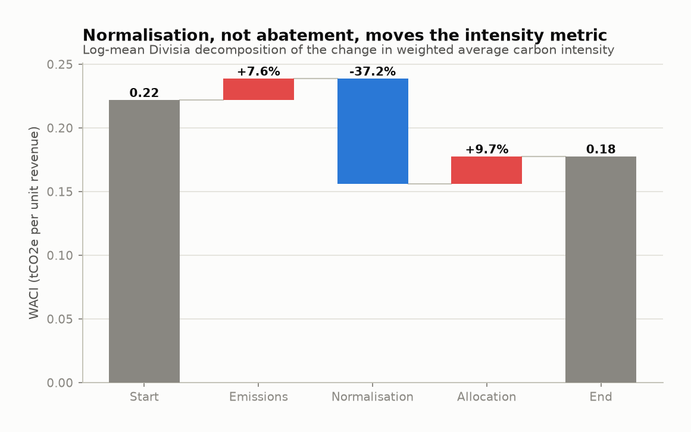
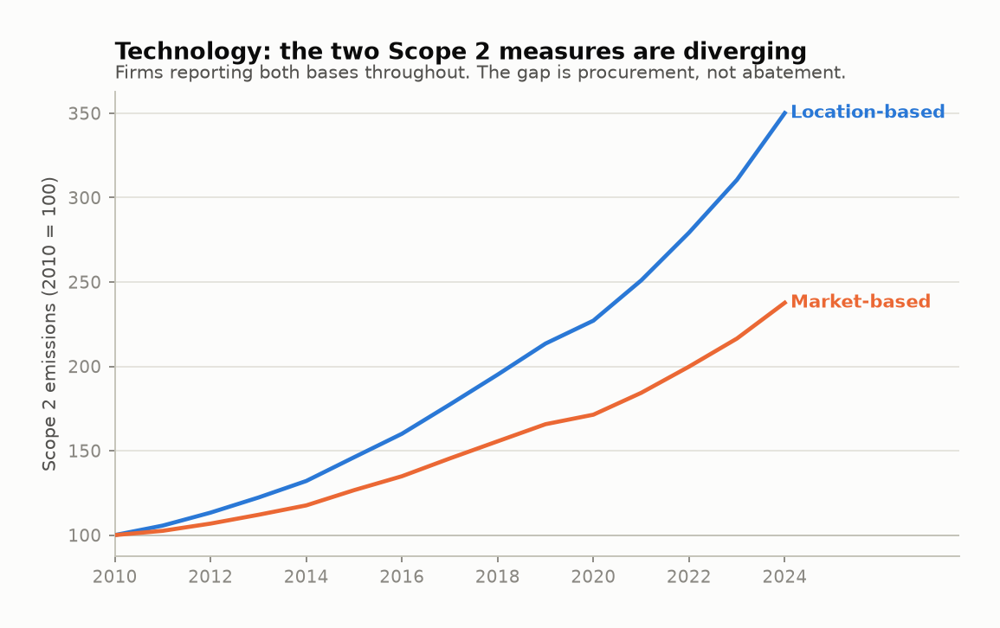
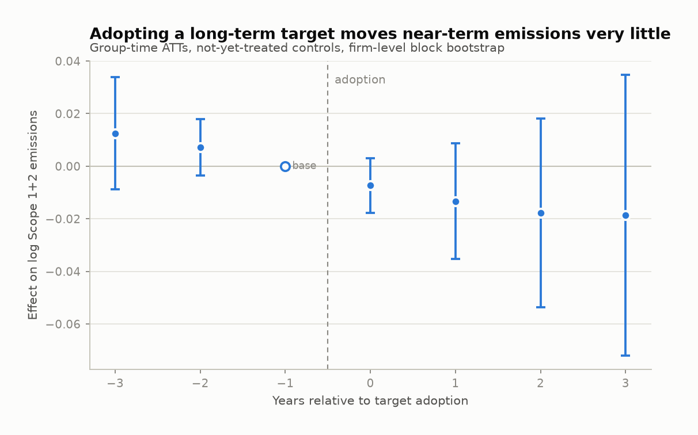
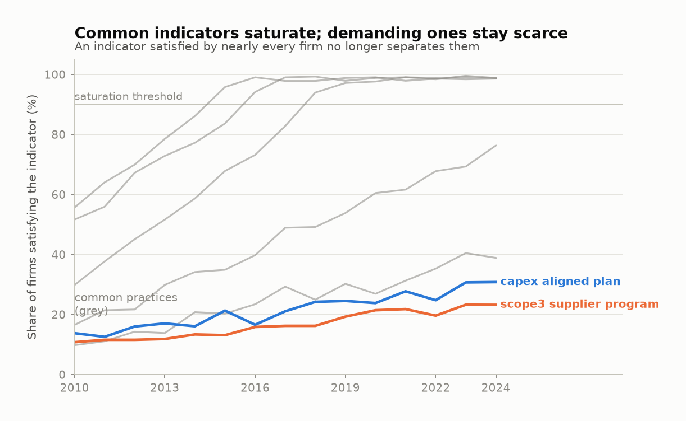
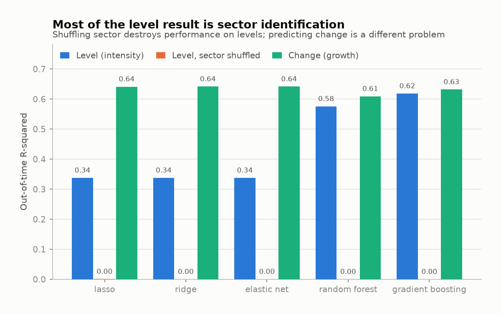
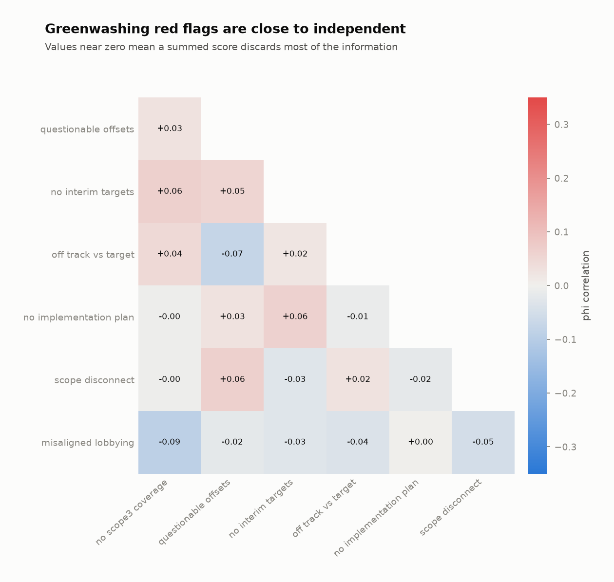

# The measured transition and the real one: a review of corporate decarbonisation indicators and what they predict

**Working paper / review article**
Prepared from a corpus of fifteen studies published between 2023 and 2026.

---

## Abstract

Corporate climate commitments have become close to universal among large listed
companies, and corporate carbon reporting has improved enough that portfolio-level
emissions accounting is now routine. Physical abatement has not kept pace. This review
brings together fifteen recent empirical studies to argue a specific point: most of the
measured improvement in corporate carbon performance sits in the parts of the accounting
system that respond to procurement and disclosure decisions, and comparatively little of
it sits in the parts that respond to production. Three findings recur across studies that
use different data and different identification strategies. Emissions-reduction effects
attributed to target-setting appear in market-based Scope 2 and disappear in
location-based Scope 2. Headline declines at portfolio level are dominated by index
composition and by revenue growth rather than by investee abatement. Target adoption
carries almost no accountability, with roughly a third of expiring targets simply
vanishing from disclosure without consequence.

I then review the firm-level features that have been tested as predictors of
decarbonisation, and separate them into those with stable signs across studies
(regulatory exposure, committed capital, demanding management practice, target
structure), those that are unstable or reverse sign (aggregate governance and ESG
scores, compensation design), and those that function as warning signs rather than
predictors (Scope 3 exclusion, offset reliance, misaligned lobbying, disclosure
vagueness). Two structural problems cut across the whole indicator literature. Indicators
saturate: as an indicator becomes universal it stops carrying information, which means
predictive power decays and has to be re-estimated rather than assumed. And greenwashing
indicators are close to orthogonal to each other, so the common practice of summing them
into a composite score discards most of what they contain.

The review closes with design rules for empirical work in this area and an accompanying
open codebase that implements the analyses the argument depends on.

---

## 1. Why this review

There is now a large enough body of careful empirical work on corporate climate targets
that the interesting question has shifted. Five years ago the open question was whether
companies would set targets at all. They did: in a sample of 1,972 large companies drawn
from the Transition Pathway Initiative universe, long-term net zero commitments went from
70 in 2019 to 1,236 by 2024, or 63% of the sample (Dietz and Hastreiter 2026). Across the
FTSE All-World, 70% of constituents disclosed a climate target in 2024 against 7% in
2018, and 57% disclosed a net-zero commitment against 1% (LSEG 2026).

The open question now is what any of that means for physical emissions, and by extension
which observable company characteristics an investor, regulator or researcher can use to
tell a firm that is going to decarbonise from one that is not. That question has a
practical edge. Portfolio carbon metrics are embedded in regulatory disclosure regimes,
investment mandates and, in some cases, binding decarbonisation targets. If those metrics
move for reasons unconnected to physical abatement, the mandates built on them will
reward the wrong behaviour.

My reading of the recent evidence is that this is largely what has happened. The review
is organised around that claim. Section 2 sets out where corporate decarbonisation
actually stands. Section 3 works through the measurement choices that shape nearly every
published estimate in this field, because several apparent empirical findings turn out to
be properties of those choices. Section 4 covers accountability. Section 5 identifies the
challenges that follow. Sections 6 to 8 review candidate predictive indicators, and
Section 9 sets out design rules that follow from the review. Section 10 lists what I think
the field still needs.

A note on the evidence base. This review draws on fifteen studies, listed in the
references, that I read in full. Where I make a claim I have tried to attach a number and
a source to it. Where studies disagree I have said so rather than averaging them, because
in several cases the disagreement is the finding.

---

## 2. Where corporate decarbonisation actually stands

### 2.1 Commitment has saturated, delivery has not

The adoption statistics are no longer the interesting part. Disclosure of Scope 1 and 2
emissions reached 81% of FTSE All-World constituents by count in 2024, up from 55% in
2016. Developed-market issuers are at 90%. Emerging-market disclosure rose from 41% to
73%, though that improvement is almost entirely China, where disclosure went from under
5% to over 30%; excluding China, emerging-market disclosure has barely moved since 2016
(LSEG 2026).

Set against that, the delivery numbers are modest. The median FTSE All-World constituent
reduced emissions by between 0% and 1% per year outside the pandemic year, which means
emissions were still rising for roughly half the index. Dispersion is wide: in 2023–24 the
top quartile cut emissions by 7% or more while the bottom quartile grew them by 8% or more
(LSEG 2026).

The gap between stated ambition and quantifiable commitment is visible even within the
disclosure itself. Of the emissions covered by some disclosed climate target in the FTSE
All-World, 9.5 Gt sit under a target of some kind, 7 Gt under a target that can be
translated into an absolute reduction, and 5 Gt under a target covering 100% of in-scope
emissions. Aggregating the targets that can be quantified implies Scope 1 and 2 reductions
of about 25% by 2030 and 50% by 2050, which is a good deal less than a 57% net-zero
adoption rate would lead one to expect (LSEG 2026).

### 2.2 How much of the measured decline is real

The FTSE All-World's Scope 1 and 2 emissions have been roughly flat at about 12.5 GtCO2e
since 2019, which is around 23.5% of global emissions. Over the same period every major
intensity measure fell by about a third. Weighted average carbon intensity fell 5% per
year between 2016 and 2024, intensity per EVIC fell 6%, intensity per market cap 5%. Global
emissions per unit of GDP fell about 2% (LSEG 2026).

Decomposing those intensity declines is where the argument of this review starts. Using a
logarithmic attribution that splits each change into a constituent-emissions term, a
normalisation term and an allocation term, LSEG find that normalisation and allocation
dominate. For the FTSE All-World over 2020–2024, constituent emissions *added* to
intensity while the revenue denominator and index composition pulled it down. The
corporate-bond results are starker. In the high-yield universe, aggregate emissions fell
9% per year while the chained series, which follows only issuers present in consecutive
years, fell 2%. Between 2016 and 2019 allocation effects alone removed 66% of high-yield
WACI as higher-intensity issuers left the index.

<picture>
  <source media="(prefers-color-scheme: dark)" srcset="figures/fig1-attribution-dark.png">
  
</picture>

**Figure 1.** Log-mean Divisia decomposition of a change in weighted average carbon intensity. The normalisation term dominates while constituent emissions push the metric up. Method illustration on the synthetic panel, not an empirical estimate.

This matters beyond portfolio accounting because it establishes the general point: a
carbon metric can fall a long way without any company emitting less. The chained series is
the useful construct here, and it transfers directly to firm-level work. Holding the
perimeter constant separates what companies did from what the sample did.

### 2.3 The renewable electricity wedge

The second component of the argument comes from two studies that arrive at the same place
by different routes.

Ruiz Manuel and Blok (2023) evaluated 102 of the largest members of the Science Based
Targets initiative and RE100 by revenue, using disclosed environmental data for 2015–2019.
Collective Scope 1 and 2 emissions fell 35.6% from a baseline of 808.7 MtCO2e, which looks
like strong evidence that these initiatives work. The disaggregation is less encouraging.
Most of that reduction is concentrated in eight emission-intensive companies. Most members
show little evidence of emissions reductions inside their own operations and achieve
progress through renewable electricity purchases. Of the renewable energy purchased, 71%
came through sourcing models with low additionality, principally unbundled energy
attribute certificates and utility green premiums, which are unlikely to cause additional
renewable generation.

Schüder and Zülch (2026) reach a compatible conclusion from an entirely different design.
They apply coarsened exact matching to 3,113 listed firms in Europe, North America and
Asia over 2015–2024, and track carbon performance for up to four years after SBTi
participation. SBTi participation is associated with significant reductions in Scope 1
carbon intensity in every post-participation year, with coefficients from −0.368 at t+1 to
−0.511 at t+4. For Scope 2 the result splits by accounting method. Market-based Scope 2
shows statistically significant reductions at t+2 and t+3. Location-based Scope 2 shows
coefficients that are consistently negative but fall above the 10% threshold in most
specifications. Scope 3 shows no measurable effect at all.

Location-based Scope 2 reflects the emissions intensity of the grid a company actually
draws from. Market-based Scope 2 reflects the contracts and certificates it has bought.
When an effect is present in the second and absent in the first, the most economical
explanation is procurement rather than abatement. That Ruiz Manuel and Blok independently
document low additionality in exactly those procurement channels makes the reading harder
to avoid.

The LSEG data show the same wedge opening in the sector where electricity demand is
growing fastest. Among FTSE All-World constituents that consistently disclosed both
measures from 2020 to 2024, Technology's location-based Scope 2 rose 60% while its
market-based Scope 2 rose 22%. Technology Scope 1 and 2 emissions rose 28% between 2019
and 2024, more than any other sector, and Scope 2 is about 84% of that sector's total.

<picture>
  <source media="(prefers-color-scheme: dark)" srcset="figures/fig2-scope2-wedge-dark.png">
  
</picture>

**Figure 2.** The two Scope 2 measures for firms reporting both throughout. Market-based reporting absorbs procurement; location-based tracks the grid. Method illustration on the synthetic panel.

Three independent sources, then, point at the same seam in the accounting system. I take
this to be the central empirical fact about corporate decarbonisation as currently
measured.

---

## 3. Five measurement choices that shape the findings

Before turning to predictors it is worth being explicit about the measurement decisions
that sit underneath every estimate in this literature. Several published findings are
better understood as consequences of these decisions than as facts about firms.

### 3.1 Scope 2 accounting method

Covered above. The practical implication for research design is that a study which pools
location-based and market-based Scope 2, or which uses whichever the company reported,
is partly measuring procurement policy. Any firm-level decarbonisation label needs the
method pinned, and location-based is the conservative choice if the question is physical
abatement. It is worth noting that the divergence will widen: electricity demand growth
from data centres is running ahead of clean procurement in some markets, and the two
series have no reason to reconverge.

### 3.2 Scope 3

Scope 3 reporting has improved in volume and not in usefulness. Across the FTSE All-World,
61% of companies disclosed at least one Scope 3 category in 2024, up from 35% in 2016, but
only 40% disclosed a material category. The composition of disclosure is close to inverse
to materiality. Category 6, business travel, is the most frequently disclosed at 44% of
firms and accounts for under 1% of reported Scope 3 volume. Category 11, use of sold
products, accounts for 21.4% of volume and is disclosed far less often (LSEG 2026).

Schüder and Zülch find no SBTi effect on Scope 3. Dietz and Hastreiter test whether firms
whose net zero targets include Scope 3 reduce emissions more than those whose targets do
not, and find no statistically significant difference, though the coefficients are
negative. Brown, Hsu and Manya find that lack of Scope 3 coverage is the single most
common greenwashing red flag, present in 70% of pledging companies.

The reasonable conclusion is that Scope 3 currently cannot support cross-sectional
classification of firms. It can support within-sector comparison in sectors where the
material category is well defined and widely reported, and it should be treated as
missing elsewhere rather than imputed.

### 3.3 Reported against estimated data

This distinction does more work than it usually gets credit for. LSEG's attribution splits
the emissions contribution by data source precisely because estimated and reported
emissions behave differently. Their own caveat on the Transition Pathway Initiative result
is instructive: the dispersion in the lowest management-quality band is the widest of any
band and is over-represented at both extremes, but much of that reflects smaller companies
with estimated emissions and largely disappears among disclosed emitters.

Bingler et al. (2024) hit the same issue from the other side and are unusually candid
about it. Their cheap talk index correlates with emissions growth in third-party estimated
data from Urgentem but shows no correlation in self-reported data. They interpret this as
firms with high emissions growth being both less likely to disclose and more prone to
vague language, and they deliberately avoid basing the analysis on self-reported data
because cheap talk and self-report reliability are likely to be positively correlated,
which would confound the estimate. That is the right call. It also means the headline
result rests on a vendor's estimation model, and if that model uses disclosure
characteristics as inputs then part of the correlation is mechanical. The authors do not
claim otherwise, but users of the result should hold it more loosely than the abstract
suggests.

### 3.4 Denominator choice

Intensity metrics divide by something, and the something moves. Revenue denominators move
with price levels, commodity cycles and inflation. EVIC and market capitalisation move with
valuations and, in EVIC's case, reward leverage. Physical denominators are the most
defensible measure of carbon efficiency and exist for only a minority of sectors (LSEG
2026). No choice is neutral, and the normalisation term in LSEG's attribution is frequently
larger than the emissions term.

### 3.5 Metric divergence

Fliegel (2026) assembles eight firm-level transition risk metrics, covering reported EU
taxonomy alignment of capex and revenues, emission intensities, Refinitiv and MSCI
E-scores, the Refinitiv Business Classification, and text-based measures, and computes
rank correlations. Within-group correlations are positive but not high: 0.73 for
taxonomy-based measures, 0.60 for emission-intensity-based, 0.58 for text-based.
Between-group correlations are close to zero. Most striking, all taxonomy-based proxies
correlate *negatively* with inverted emission intensity metrics, meaning that firms
scoring well on one family of measures tend to score badly on the other.

Fliegel then evaluates the metrics by the return sensitivity of portfolios built on each
to market-wide transition risk news. Taxonomy alignment and sector/technology
classification perform best for green portfolios; MSCI E-scores and Refinitiv Business
Classification perform best for brown firms. His conclusion is that forward-looking
measures such as taxonomy capex alignment outperform pure exposure measures, and that
findings resting on a single transition risk metric should be treated with caution.

For anyone building a predictive model, the practical consequence is that "transition
risk" is not one variable. Choosing a different proxy will produce a different answer, and
robustness across proxies is the minimum standard.

---

## 4. Targets are not policed

Jiang, Kim and Lu (2025) examined the 1,041 firms whose emissions targets expired in 2020.
Of those, 88 (9%) failed and 320 (31%) disappeared, meaning the target vanished from
disclosure without a stated outcome. Only three of the failed firms received any media
coverage. After a firm misses its target the authors find no significant market reaction,
no change in media sentiment, no change in environmental scores, and no change in
environment-related shareholder proposals. Announcing the target, by contrast, is rewarded
with significant improvements in media sentiment and environmental scores.

The asymmetry is the finding. There is a reward for announcing and no penalty for missing,
and the most common outcome is neither success nor failure but silence. Any model that
treats target adoption as a costly signal is mispricing it, because in this sample it was
not costly.

Bolton and Kacperczyk (2025) reach a complementary conclusion on selection. Firms that
commit do subsequently reduce emissions, but the firms that commit, and those that make
the most ambitious commitments, tend to be the ones with lower emissions already. Firms
are less likely to make an ambitious commitment when their Scope 1 emissions are higher.
Their summary is that the commitment movements "have been successful in drawing the
willing but have found greater resistance from the companies that most need to reduce
their emissions". The effect on overall emissions, including non-committing firms, has
been small.

Dietz and Hastreiter (2026) test the near-term behavioural consequences of long-term net
zero adoption directly, using staggered difference-in-differences with matching on the TPI
universe. They find little evidence of large or immediate emissions reductions. Emissions
coefficients are generally negative and consistent with gradual reduction, but noisy and
imprecisely estimated.

<picture>
  <source media="(prefers-color-scheme: dark)" srcset="figures/fig5-event-study-dark.png">
  
</picture>

**Figure 3.** Group-time average treatment effects of long-term target adoption on log Scope 1+2 emissions, with not-yet-treated controls and a firm-level block bootstrap. Estimates are negative and indistinguishable from zero. Generated on a synthetic panel in which adoption has no causal effect and adopters are selected on an unobserved propensity, so this is a demonstration that the estimator recovers the null where a naive comparison would not.

Their governance results are the more interesting part, and I return to them in Section
6.3 because they bear on indicator design rather than on accountability.

---

## 5. What follows for the next five years

Four problems seem to me to follow from the evidence above.

**Electricity demand growth is about to test the Scope 2 convention.** Technology sector
emissions are rising faster than any other sector's, driven by data centre load, and the
gap between location-based and market-based reporting is already 38 percentage points over
2020–2024 for dual reporters. If clean procurement keeps pace, market-based emissions stay
contained while physical grid emissions rise. If it does not, today's demand growth
becomes tomorrow's reported growth. Either way, investors relying on market-based figures
will see the problem late.

**The quantifiable target base is much smaller than the headline.** Roughly half the
emissions nominally covered by targets sit under targets that either cannot be converted
into an absolute reduction or do not cover full scope. Regulatory frameworks that count
target adoption rather than target structure will keep producing coverage statistics that
overstate committed abatement.

**Indicator saturation is eroding the discriminating power of the standard measures.**
This is developed in Section 9, but the short version is that when 70% of an index has a
target and 81% disclose emissions, those variables no longer separate firms. Dietz and
Hastreiter provide direct evidence of the mechanism.

**Scope 3 remains unusable for cross-sectional work** and is where the majority of value
chain emissions sit for most non-utility sectors. Nothing in the current disclosure
trajectory fixes this before 2030.

---

## 6. Indicators with a stable relationship to decarbonisation

I group candidate predictors by how much confidence the current evidence supports. The
criterion is not effect size but whether the sign is stable across studies with different
samples and designs.

### 6.1 Carbon pricing exposure

This is the best-identified result in the field. Colmer, Martin, Muûls and Wagner (2025)
use administrative data on French manufacturing firms to estimate that the EU Emissions
Trading System caused regulated firms to reduce CO2 emissions by 14–16%, with no
detectable contraction in economic activity, no evidence of outsourcing to unregulated
firms or markets, and targeted investment reducing the emissions intensity of production.

Two features of the result deserve emphasis. First, the effect is concentrated in the
phases where the scheme actually bit; point estimates for Phase I are close to zero and
statistically insignificant. Regulatory exposure only predicts abatement when the
regulation is stringent, which means a binary "covered by an ETS" feature is too coarse.
Second, the authors rationalise the absence of negative economic effects through
inattention: firms with low initial productivity or high energy intensity underinvest in
energy-saving capital before regulation, and show larger emissions reductions and
increases in economic activity afterwards. If that mechanism generalises, the firms where
regulation produces the most abatement are identifiable in advance.

### 6.2 Committed capital

Fliegel's evaluation puts EU taxonomy capex alignment among the strongest performing
transition metrics, and his general conclusion favours forward-looking measures over
exposure measures. The logic is straightforward: capital expenditure is a decision that
has already been made and paid for, which makes it harder to reverse than a stated target.

The limitation is coverage. Taxonomy capex alignment is reported under a regime that
applies to a subset of firms in one jurisdiction, so any global model faces systematic
missingness correlated with region. Missingness of this kind is informative and should be
modelled as such rather than imputed.

Frisch et al. (2025) make a compatible argument from a qualitative direction. Their
framework treats the core business through three dimensions, management, value chain and
investments, with three categories each, and their central claim is that decarbonisation
should be assessed by how deeply it is integrated into the core business rather than by
counting climate management activities in isolation. Investment allocation is the
dimension in their scheme that is hardest to fake.

### 6.3 Demanding management practice, weighted by rarity

This is the most useful methodological finding in the corpus and it comes from Dietz and
Hastreiter (2026).

They measure climate management using TPI Management Quality indicators, and construct
three versions: a count of satisfied indicators, a hierarchical level, and a weighted
score that gives greater weight to less commonly implemented and more demanding practices.
The three behave differently after long-term net zero adoption. The count shows no
systematic effect. The level shows a *negative* post-adoption effect, statistically
significant at t+3. The weighted score shows positive, increasing and statistically
significant effects.

The explanation they give for the negative result on levels is that non-adopters caught up
with adopters on basic management practices. Once nearly everyone has a board committee
and a disclosure process, having one stops distinguishing you, and a measure built on
counting them will show adopters converging toward the mean.

Decomposed by TCFD theme, the pattern holds: the Governance theme, which contains the less
ambitious indicators, shows negative post-adoption effects, while the Strategy theme,
which contains the more demanding ones, shows positive and increasing effects. The
Strategy result is preceded by a significant coefficient in the year before adoption,
which the authors attribute to anticipation, and cohort analysis locates that pre-trend
in the 2021 cohort specifically.

<picture>
  <source media="(prefers-color-scheme: dark)" srcset="figures/fig3-saturation-dark.png">
  
</picture>

**Figure 4.** Indicator prevalence over time. Once a practice is satisfied by nearly every firm it stops separating them, which is why a raw count of indicators can lose discriminatory power while a rarity-weighted score retains it. Method illustration on the synthetic panel.

Two lessons. Rarity-weighting a governance indicator set recovers signal that a raw count
destroys. And the timing of improvement runs slightly ahead of the announcement, which
means event studies keyed to announcement dates will understate the association.

### 6.4 Target structure

Target design carries information that target existence does not. The LSEG funnel from
9.5 Gt to 7 Gt to 5 Gt is one form of evidence. Bolton and Kacperczyk note that absolute
reduction commitments differ from intensity commitments in a way that matters, since
intensity targets permit total emissions to rise. Dietz and Hastreiter find weak,
directionally negative evidence that targets including Scope 3 are associated with larger
subsequent reductions, though not statistically significant.

Silvia et al. (2026) provide the most direct test. Using 239 Fortune Global 500
non-financial firms and 1,126 firm-year observations over 2018–2023, they construct a
Climate Transition Plan credibility index and find that higher credibility is
significantly associated with lower subsequent carbon emission changes. External assurance
strengthens the association; mandatory or quasi-mandatory disclosure environments provide
more modest moderating support. The Scope 3 subsample produces weaker evidence, in line
with everything else in this review. The design is observational panel, and the authors
are appropriately careful about causal language.

### 6.5 Past emissions

Any model in this area has to beat a persistence baseline. Emissions trajectories are
highly autocorrelated, and the strongest single predictor of next year's emissions is this
year's. None of the studies in this corpus is primarily a forecasting paper, but the point
surfaces repeatedly: Bolton and Kacperczyk control for prior emissions changes over one,
three and five years; Schüder and Zülch match on pre-treatment characteristics; Dietz and
Hastreiter match on emissions trajectory.

The relevant caution concerns Xu, Wei and Ji (2026), which is the one explicitly predictive
study in the corpus. They compare six models on listed firms over 2016–2023 and find
XGBoost best, with R² of 0.95 in the pre-COVID period using all variables and 0.85
excluding carbon-related variables. Within the governance category, board characteristics
carry the highest importance, and with the carbon signal removed the model shifts weight
onto liquidity, profitability and firm value.

<picture>
  <source media="(prefers-color-scheme: dark)" srcset="figures/fig6-level-vs-change-dark.png">
  
</picture>

**Figure 5.** Out-of-time R-squared for the same feature set against a level target and a change target, with a sector-shuffled control. Shuffling sector destroys performance on levels, which is what most of that performance was. Method illustration on the synthetic panel.

The result is interesting but it should not be read as evidence that governance predicts
decarbonisation. Their target is carbon emission *intensity*, a level, not a change. An R²
of 0.85 predicting intensity levels without carbon inputs is mostly the model recovering
sector and size, which are the dominant determinants of how carbon-intensive a firm is.
Predicting which firms are dirty is a different and much easier problem than predicting
which firms are getting cleaner. The distinction is easy to lose and it separates most of
the machine learning literature in this area from the question investors actually have.

---

## 7. Indicators that flag the absence of transition

A separate literature has developed around detecting the opposite condition. These
measures are not predictors with the sign reversed; they behave differently and should be
handled differently.

### 7.1 The red flag framework

Brown, Hsu and Manya (2026) built the largest empirical assessment of its kind, combining
CDP, InfluenceMap and Net Zero Tracker data across 4,131 companies, of which 3,574 made
some climate claim. They assess seven dimensions of greenwashing risk. Of the companies
making a pledge, 96% exhibit at least one risk indicator.

Prevalence by dimension:

| Red flag | Share of pledging companies |
|---|---|
| Lack of Scope 3 coverage | 70% |
| Questionable use of carbon offsets | 40% |
| No interim targets | 21% |
| Lack of progress toward targets | 20% |
| No implementation plan | 18% |
| Neutrality claim on a CO2-only or unspecified gas inventory | 11% |
| Lobbying inconsistent with commitment | 10% |

One dimension is routinely misread, including in the paper's own results text,
which describes it as a failure "to comprehensively address all emission
scopes". Their Methods section is explicit that it concerns *gases*: the flag
fires when a company claims net zero, GHG neutrality or similar while its
inventory covers only carbon dioxide or does not say which gases it covers. A
company with a plain percentage-reduction target is not caught by it at all,
because there is no neutrality claim for the incomplete inventory to
contradict.

Two-fifths of companies show exactly one flag, and 12% are flagged on four or more.
Restricting to firms with explicit net-zero targets barely moves the overall incidence
(95.8%) but changes the composition substantially: questionable offset use is 29
percentage points higher, absence of an implementation plan 10 points higher, while lack
of Scope 3 coverage is 22 points lower.

Regional variation is modest overall, at 95% in Europe and the Global South against about
97% in North America and East Asia and the Pacific, but the lobbying indicator is
noticeably less prevalent among European firms.

### 7.2 The orthogonality problem

The most consequential result in that paper is easy to miss, and the authors act
on it themselves: they decline to aggregate the seven dimensions into a single
index at all. Their stated reasons are that no agreed weighting approach exists,
that any weighting would be "inherently subjective", and that binary indicators
with no intensity dimension "could dilute their meaning" once combined. The
supporting evidence is that the seven indicators are only weakly correlated with
each other, and several of the pairwise phi correlations are negative. Higher target ambition is *negatively* associated with Scope 3 gaps (r = −0.19)
and with offset reliance (r = −0.18). Being off-track shows near-zero correlations with
almost everything.

<picture>
  <source media="(prefers-color-scheme: dark)" srcset="figures/fig4-redflag-matrix-dark.png">
  
</picture>

**Figure 6.** Pairwise phi correlations between the seven red flags. Values cluster near zero and several are negative. Method illustration on a synthetic panel calibrated to the prevalences Brown, Hsu and Manya report.

Greenwashing, on this evidence, is not a single latent trait that a composite score can
measure. A firm with an ambitious target and heavy offset reliance and a firm with a
narrow target and no offsets are different objects, and summing flags makes them look
identical. The framework is better used as a profile, and the analytically interesting
question is which combinations occur together and what each combination predicts.

### 7.3 Disclosure language

Bingler et al. (2024) fine-tune ClimateBERT to build ClimateBertCTI, a classifier for
climate-related cheap talk, and construct a firm-level cheap talk index from annual
reports of MSCI World constituents over 2010–2020. Four results: targeted climate
engagement is associated with less cheap talk; supporting voluntary disclosure frameworks
is associated with *more* cheap talk; cheap talk is associated with higher emissions
growth; and cheap talk is associated with more negative news coverage and controversies.
The utility sector's index rose by almost 100% over the period.

The caveats from Section 3.3 apply, and there is a second one: the emissions growth
relationship is insignificant over the full sample period and emerges in the later years,
which the authors attribute to increased public awareness after 2015. A relationship that
appears only in a subperiod, only in one data source, deserves replication before it goes
into a production model.

### 7.4 Target detection at scale

Schimanski et al. (2023) provide the tooling layer. ClimateBERT-NetZero is trained on an
expert-annotated set of 3.5K text samples to classify whether a passage contains a net
zero or reduction target, reaching over 96% accuracy and outperforming larger
general-purpose models on the task. Combined with question-answering models it can extract
the ambition expressed in a detected target, and the authors demonstrate it on quarterly
earnings call transcripts.

This matters for indicator construction because the target-structure variables in Section
6.4 are expensive to collect by hand. A classifier that separates net zero claims from
quantified reduction targets at scale is the input that makes structural target features
tractable across a large universe.

---

## 8. Indicators that do not behave as expected

It is worth being blunt about the measures that do not survive contact with the evidence,
because several are widely used.

**Aggregate governance and ESG scores.** Oyewo (2023) analyses 336 multinationals across
42 non-financial industries and 32 countries over 15 years and finds relationships that
are both curvilinear and, in places, opposite in sign to the standard expectation. Board
gender diversity, CEO duality and the presence of an ESG committee are negatively
associated with carbon emissions rate, which is the expected direction. Board independence
and ESG-based compensation have significant *positive* associations, meaning firms with
more independent boards and with ESG-linked pay had worse carbon performance.

Schüder and Zülch find the same sign independently. In their Scope 1 models the governance
control carries a positive and significant coefficient (0.007 to 0.008, p < 0.01 in three
of four specifications), again meaning higher governance scores went with higher carbon
intensity.

I do not think either paper establishes that good governance causes emissions. The more
likely reading is that governance scores are correlated with size, sector and disclosure
propensity in ways that survive the controls used. But that is precisely the problem: a
variable whose sign flips depending on what else is in the model is not a usable
predictor, and the widespread practice of including an ESG or governance pillar score as a
proxy for climate seriousness is not supported.

**ESG-linked executive compensation specifically.** Oyewo's positive coefficient is a
direct challenge to the assumption that tying pay to ESG outcomes improves them. The
plausible mechanism is that generic ESG-linked pay is easy to satisfy with peripheral
action.

**Headline net zero pledges.** Dietz and Hastreiter's central result is that adoption is
followed by little immediate change in either emissions or broad governance. Their framing
is that such commitments are "neither purely symbolic nor immediately transformative, but
are embedded within a gradual process of organisational change". Combined with Jiang, Kim
and Lu on the absence of consequences for missing targets, and Bolton and Kacperczyk on
selection, the presence of a pledge is close to uninformative on its own.

**Single transition risk metrics.** Fliegel's divergence result means any finding resting
on one proxy is conditional on that proxy.

---

## 9. Design rules

Five rules follow from the review. They are addressed to anyone building firm-level
empirical work or a predictive model in this area.

**Construct the label before the features.** The dependent variable should be a
constant-perimeter, multi-year change in Scope 1 and 2 emissions with the Scope 2
accounting method fixed, computed on disclosed emissions for training. Single-year changes
carry too much noise, mixed Scope 2 methods measure procurement, and estimated emissions
in the label mean the model partly learns the vendor's estimation function. Restatements
from mergers, acquisitions and divestments are the largest practical hazard and have to be
handled explicitly, which is what the chained construction is for.

**Beat persistence before claiming a finding.** Report every feature's contribution net of
lagged emissions growth and sector by region fixed effects. A model that predicts
intensity levels is answering a different question.

**Weight indicators by rarity and re-estimate over time.** Dietz and Hastreiter's weighted
Management Quality result generalises. An indicator's information content is a function of
how many firms satisfy it, which changes year by year. A feature set fixed in 2019 will
quietly decay. Discriminatory power should be measured per indicator per period, and the
decay itself is a finding worth reporting.

**Keep red flags as a profile.** Given phi correlations near zero and several negative
pairs, summing the seven dimensions into a greenwashing score discards most of the
information. Model them jointly, look at which combinations co-occur, and test whether
particular combinations predict subsequent emissions differently.

**Vary the transition risk proxy and report the spread.** Fliegel's recommendation is the
right minimum standard. Where a result holds under taxonomy alignment, emission intensity
and text-based measures alike, it is a result. Where it holds under one, it is a
description of that measure.

---

## 10. What the field still needs

Four things, in rough order of how much difference they would make.

A location-based Scope 2 series with coverage comparable to market-based would settle the
question this review is built around. At present the cleanest evidence comes from the
subset of firms that dual-report, which is a selected sample.

Material-category Scope 3 disclosure, sector by sector, would make value chain emissions
analysable. Volume of Scope 3 disclosure has risen without this happening.

Outcome tracking for targets, in the sense of a public record of what happened to every
expiring target, would change the incentive structure Jiang, Kim and Lu document. The
finding that 31% of targets disappear without comment is a data infrastructure failure as
much as a corporate governance one.

Replication of the text-based indicators on reported rather than estimated emissions, or
on a jurisdiction with mandatory assurance, would establish whether the cheap talk
relationship is a behavioural fact or a property of an estimation model.

---

## A note on what this review does not establish

Most of the studies here are observational. Colmer et al. is the exception with a
credible causal design, and it addresses regulation rather than voluntary action. Schüder
and Zülch use matching and a stacked difference-in-differences robustness check, and Dietz
and Hastreiter use staggered difference-in-differences with matching, but both are working
with voluntary adoption, where selection is severe and the authors say so. Silvia et al.
is explicitly interpreted as associational.

The recurring pattern I have described, where improvement concentrates in procurement-
sensitive and composition-sensitive measures, is consistent across enough independent
designs that I am fairly confident in it. The firm-level predictors in Section 6 are on
weaker ground, and the honest summary is that regulatory exposure and committed capital
have reasonable support, rarity-weighted management practice has one good study behind it,
and everything else is contested.

---

## A note on the estimators

Because almost every study reviewed here rests on the same two techniques, it is
worth being explicit about what they do and where they fail. Both are implemented
in the accompanying code.

**Matching.** Adoption of a climate target is voluntary and strongly selected.
Bolton and Kacperczyk find that committers already have lower emissions and that
firms are less likely to make an ambitious commitment when their Scope 1 emissions
are higher. Coarsened exact matching, as Schüder and Zülch use it, bins covariates,
keeps only strata containing both adopters and non-adopters, and discards the rest.
The discard is the cost and should always be reported: over-specify the covariate
list and half the sample can disappear, at which point the estimate applies to a
population that no longer resembles the one of interest.

**Staggered difference-in-differences.** Firms adopt in different years, so there
is no single before and after. The standard two-way fixed effects specification
handles this badly: with heterogeneous effects it uses already-treated firms as
controls for later-treated ones, and the resulting weighted average can carry the
wrong sign even when every underlying effect shares a sign. The alternative is to
estimate a separate effect for each adoption cohort and period against a clean
control group, either never-treated firms or those not yet treated, then aggregate
by event time. Dietz and Hastreiter use this approach.

Two practical points. Standard errors should be clustered or bootstrapped at the
firm level, since emissions are highly persistent within a firm and treating
firm-years as independent shrinks standard errors by roughly the square root of
the panel length. And pre-treatment estimates are part of the result, not a
diagnostic to be dropped: Dietz and Hastreiter's significant coefficient in the
year before adoption is what tells them firms begin acting before they announce.

## Code and figures

Every analysis in this review is implemented in `backend/arp/decarb/`, with the
econometrics in `backend/arp/decarb/research/`. `python -m arp.decarb.pipeline`
reproduces the descriptive results and `python -m arp.decarb.research.figures`
regenerates every figure.

**All figures in this paper are generated from a synthetic panel**, calibrated so
that its headline statistics match the magnitudes reported in the literature
reviewed here. They illustrate what each method does and what its output looks
like. They are not empirical estimates, and no number in them is evidence about
any company. The empirical claims in the text are sourced to the studies cited,
not to the figures.

The synthetic panel exists because the underlying data is licensed. Running the
same code against a real panel requires only building the input frame; the
analysis functions take the same types either way.

Method extractions for all fifteen studies - sample construction, variable
definitions, estimators, inference, target results and the specific obstacles to
replicating each - are in
[`REPLICATION_SPECIFICATIONS.md`](REPLICATION_SPECIFICATIONS.md).

**The code implements estimator families, not replications.** No number it
produces reproduces a published result, and several methods central to the
papers reviewed here are not implemented at all, among them the ClimateBert
cheap-talk index, the ClimateBERT-NetZero classifier, Fliegel's return-
sensitivity evaluation, and the EU ETS administrative-data design. A table in
`backend/arp/decarb/README.md` sets out, paper by paper, what is implemented
and to what fidelity. One point of detail is worth recording here: LSEG state
their attribution method in prose and publish the equation as an image, so the
implementation was written from the prose. Two readings of that prose turn out
to be algebraically identical except where a constituent's factors exactly
cancel, which is the one case their footnote 39 pins down, and both are
implemented.

## References

Bingler, J.A., Kraus, M., Leippold, M. and Webersinke, N. (2024). How cheap talk in
climate disclosures relates to climate initiatives, corporate emissions, and reputation
risk. *Journal of Banking and Finance*, 164, 107191.

Bolton, P. and Kacperczyk, M. (2025). Firm Commitments. ECGI Finance Working Paper No.
990/2024, January 2025. SSRN 3840813.

Brown, E., Hsu, A. and Manya, D. (2026). Red flags in green promises: a framework for
identifying greenwashing risk in corporate climate pledges. *npj Climate Action*.
doi:10.1038/s44168-026-00346-6.

Colmer, J., Martin, R., Muûls, M. and Wagner, U.J. (2025). Does Pricing Carbon Mitigate
Climate Change? Firm-Level Evidence from the European Union Emissions Trading System.
*Review of Economic Studies*, 92, 1625–1660. doi:10.1093/restud/rdae055.

Dietz, S. and Hastreiter, N. (2026). Corporate net zero targets: have they achieved
anything? Grantham Research Institute on Climate Change and the Environment, Working Paper
No. 446, April 2026.

Fliegel, P. (2026). How you measure transition risk matters: comparing and evaluating
climate transition risk metrics. *Journal of Corporate Finance*, 98, 102939.

Frisch, T., Engels, A., Rötzel, T., Johnson, M.P., Frank, B., Commelin, S. and Busch, T.
(2025). That's none of my business: A holistic framework for evaluating corporate
decarbonization at the core of business. *Energy Research & Social Science*.
doi:10.1016/j.erss.2025.104163.

Jiang, X., Kim, S. and Lu, S. (2025). Limited accountability and awareness of corporate
emissions target outcomes. *Nature Climate Change*, 15 (March 2025), 279–286.
doi:10.1038/s41558-024-02236-3.

LSEG / FTSE Russell with the UN-convened Net-Zero Asset Owner Alliance (2026).
*Decarbonising portfolios 2026: Tracking the transition across investment benchmarks.*
Fifth annual edition, September 2026.

Oyewo, B. (2023). Corporate governance and carbon emissions performance: International
evidence on curvilinear relationships. *Journal of Environmental Management*, 334, 117474.

Ruiz Manuel, I. and Blok, K. (2023). Quantitative evaluation of large corporate climate
action initiatives shows mixed progress in their first half-decade. *Nature
Communications*. doi:10.1038/s41467-023-38989-2.

Schimanski, T., Bingler, J., Hyslop, C., Kraus, M. and Leippold, M. (2023).
ClimateBERT-NetZero: Detecting and Assessing Net Zero and Reduction Targets. arXiv
2310.08096.

Schüder, M. and Zülch, H. (2026). Corporate carbon performance and the Science-Based
Targets initiative: disentangling the effects across Scope 1, 2, and 3 emissions. *Journal
of Industrial Ecology*, 30, 799–813. doi:10.1007/s44498-026-00058-4.

Silvia, M., Zhao, D., Bai, D., Xiang, D., Sartika, D., Noviardy, A., Guo, F., Jin, J.,
Song, T., Cao, T., Qiao, F., Zhu, Y., Gao, J. and Guo, Y. (2026). Do credible climate
transition plans matter for carbon performance? Evidence from Fortune Global 500 firms.
*Frontiers in Environmental Science*, 14, 1907357. doi:10.3389/fenvs.2026.1907357.

Xu, Y., Wei, P. and Ji, Y. (2026). Machine learning for predicting corporate carbon
emissions: The role of corporate governance. *Journal of Digital Economy*, 5, 1–16.
