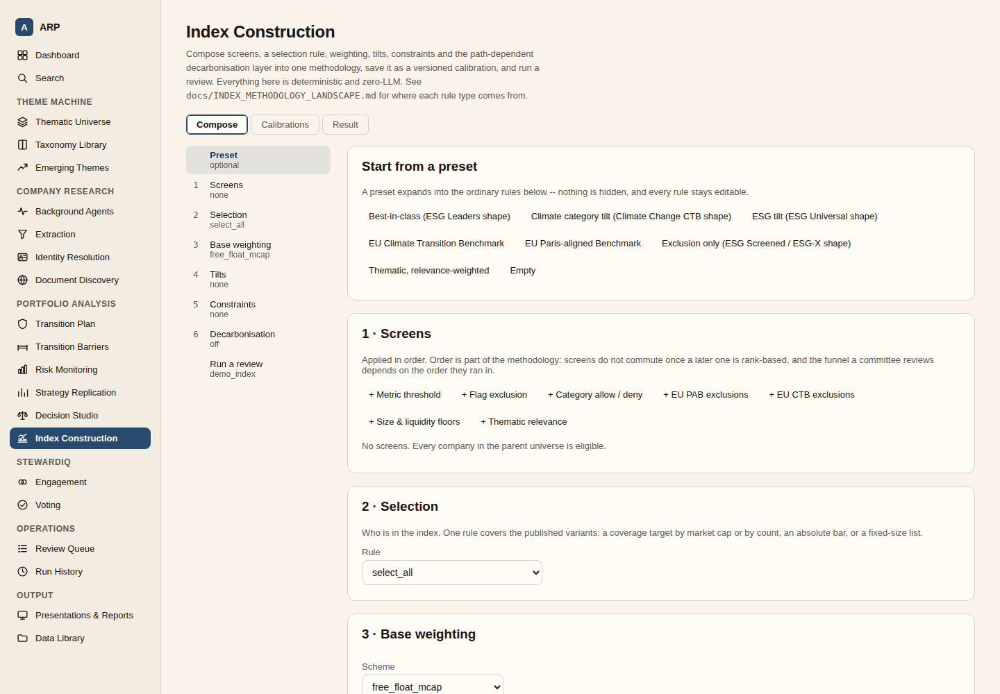
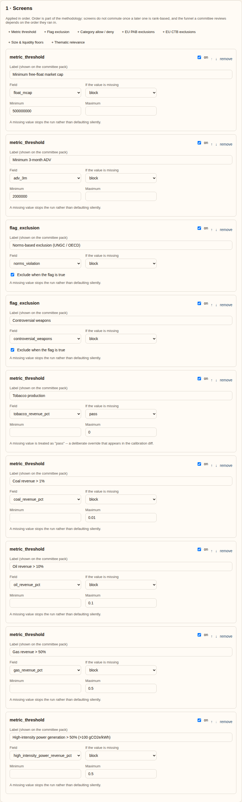
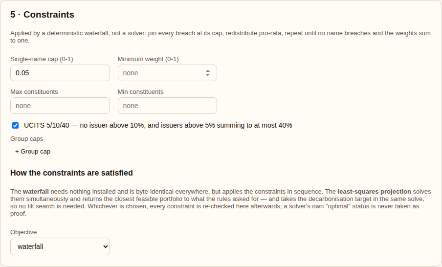
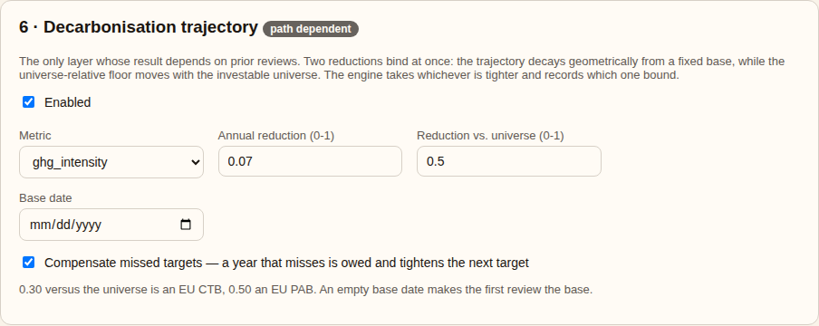
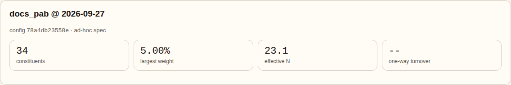
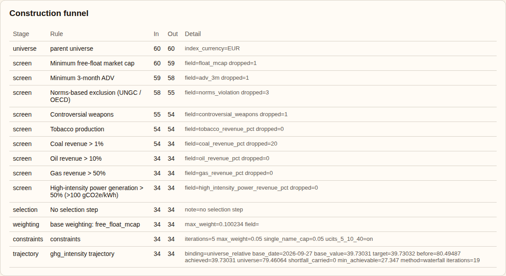
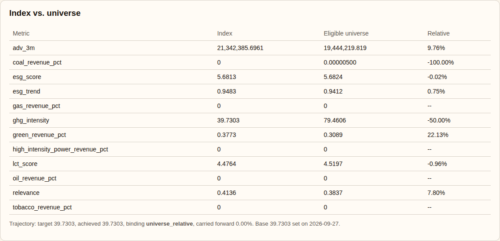
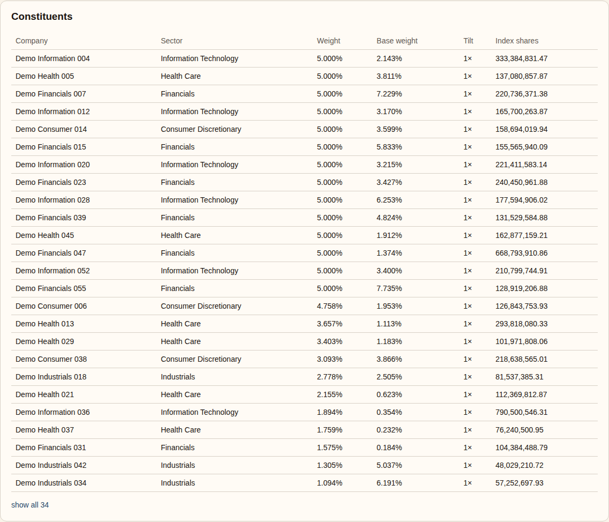
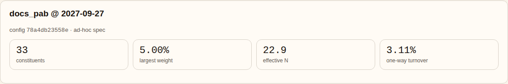

# Index construction: how the engine works

This is the reference for what the code in `backend/arp/index/` actually does when it builds an
index. The design rationale lives in [`EQUITY_INDEX_CONSTRUCTION_PLAN.md`](EQUITY_INDEX_CONSTRUCTION_PLAN.md)
and the solver choices in [`OPTIMIZATION_TOOLING.md`](OPTIMIZATION_TOOLING.md); where each rule type
comes from in published methodologies is in [`INDEX_METHODOLOGY_LANDSCAPE.md`](INDEX_METHODOLOGY_LANDSCAPE.md).

The engine is deterministic and makes no LLM calls. Anything model-derived (thematic relevance, for
example) arrives upstream as a frozen, effective-dated metric on the candidate.

## Entry point

```python
run_review(spec, candidates, *, index_id, review_date,
           prior_state=None, calibration_id=None, calibration_version=None,
           risk_model=None) -> ReviewResult
```

`backend/arp/index/pipeline.py`. It takes:

| Input | What it is |
|---|---|
| `spec: ConstructionSpec` | The methodology: screens, selection, base weighting, tilts, constraints, trajectory, calendar, rounding |
| `candidates: list[IndexCandidate]` | The parent universe: price, FX, shares, free-float factor, sector, country, plus free-form `metrics`, `flags`, `categories` |
| `prior_state: IndexState` | What the previous review left behind: divisor, level, index shares, prices, trajectory base and shortfall. `None` at inception |
| `risk_model: RiskModel` | Only needed for tracking-error objectives or budgets |

It returns a `ReviewResult`: constituents, diagnostics, one `StageTrace` per stage, the `IndexState`
for the next review, a list of exceptions, and `config_hash` (a hash of the spec).

Every stage appends a trace line (count in, count out, up to 10 dropped names, detail). That trace is
both the funnel a committee reviews and the audit trail.

## Stages

### 1. Parent universe

Candidates are sorted by `company_id`, so output never depends on input order. An empty universe
raises.

### 2. Screens (`screens.py`)

Applied in the order declared. Order is part of the methodology: it changes the funnel numbers.

| Type | Keeps a company when |
|---|---|
| `metric_threshold` | `min_value <= metric <= max_value` (epsilon-tolerant) |
| `flag_exclusion` | the flag is not equal to `exclude_when` |
| `category_screen` | the category is in `allow` (if set) and not in `deny` |

Missing data follows the rule's `missing` policy:

- `block` raises `DataQualityBlock` (the API returns HTTP 422). This is the default "fail loud" path.
- `fail` drops the company.
- `pass` keeps it.

Four derived fields are available to every rule without copying them into `metrics`:
`float_mcap`, `price`, `shares_outstanding`, `free_float_factor` (`fields.py`).

### 3. Selection (`selection.py`)

| Type | Behaviour |
|---|---|
| `select_all` | No selection step |
| `best_in_class_coverage` | Rank within each group, add names until `target_pct` of the group's float market cap (or count) is covered |
| `absolute_threshold` | Fixed score bar, optionally per group |
| `top_n` | Top N per group |

- **Buffer** (coverage rule): an incumbent just past the target stays in while coverage is below
  `target × (1 + buffer_pct)`. A new name cannot enter on the buffer. This damps turnover.
- **Empty groups** (absolute rule): `on_empty_group` decides. `leave_empty`, `fallback_relative`
  (take the top X% by rank, recorded as an exception) or `block`.
- **Ties** break on score, then float market cap, then `company_id`. The order is always total.

### 4. Base weighting (`weighting.py`)

| Scheme | Raw weight |
|---|---|
| `free_float_mcap` | float market cap |
| `equal` | 1 |
| `metric` | `max(metric, 0)` |
| `inverse_metric` | `float_mcap / max(metric, floor)`; the floor stops a near-zero value dominating |

All sums use `fsum` over sorted keys.

### 5. Tilts

Multiplicative, renormalised after each rule.

- `metric_tilt` normalises the metric (`none`, `max`, `group_max`, `rank_percentile`, or `zscore`
  clipped to ±3σ and squashed into 0–1), then maps it into a multiplier in `[floor, ceiling]`.
- `bucket_tilt` applies a fixed multiplier per category value.

The cumulative multiplier per name goes on the constituent record. The weights after tilting are kept
as the **methodology target**; the optimiser paths project from it.

### 6. Constraints (`capping.py`, `optimize.py`)

The benchmark for tracking error is the eligible universe on the base weighting. Screened-out names
stay in it as full underweights.

`ConstraintSet.solver.method` picks the approach:

| Method | Needs | What it does |
|---|---|---|
| `waterfall` (default) | nothing | Sequential and deterministic. Loops until every constraint holds at once |
| `least_squares` | cvxpy | Minimise `‖w − b‖²` with sum = 1, `0 ≤ w ≤ cap`, group caps and extra linear constraints |
| `min_tracking_error` | cvxpy + risk model | Minimise ex-ante tracking error against the benchmark |
| `max_score` | cvxpy + risk model | Maximise the weighted score within a tracking-error budget |

**Waterfall** passes, repeated until stable:

1. `min_weight` pruning (drops the smallest names, recorded as an exception).
2. Single-name cap: pin breaches at the cap, redistribute pro-rata. Stops only when no name breaches
   *and* the weights sum to 1.
3. Group caps: scale over-weight groups down, redistribute by remaining headroom so groups do not
   oscillate.
4. UCITS 5/10/40: bisect a uniform cap in [5%, 10%].

Infeasible settings (for example `cap × count < 1`) are recorded as exceptions.

**Convex methods**:

- The least-squares objective is strictly convex, so the answer is unique.
- UCITS 5/10/40 is not convex; it is handled by the same bisection around repeated solves.
- Tracking error is written as `sum_squares` of a factorised covariance (K + N terms, not N²).
- Solver tolerances and thread count are pinned for reproducibility.

**Integer mode** switches on for `max_constituents`, `min_constituents`, or an enforced `min_weight`
(`enforce_semicontinuous`). It uses a MIP solver (SCIP by default).

- Settings impossible by arithmetic (for example `max_constituents × cap < 1`) are rejected before
  any solve.
- Only a proven optimum is accepted.
- A vanishing tie-break penalty makes the choice between equivalent holdings deterministic.
- Integer constraints under `waterfall` raise rather than being silently ignored.

**The solver is not trusted.** `_verify` re-checks every constraint in plain Python, including
tracking error recomputed from the covariance. A failed or violating solve falls back to the
waterfall and records an exception (unless `fallback_to_waterfall=False`, which raises instead).
When a tracking-error budget is infeasible, the exception states the lowest tracking error reachable.
A risk model covering less than `min_risk_coverage` of index weight is refused.

### 7. Decarbonisation trajectory (`trajectory.py`)

Optional (`spec.trajectory.enabled`). The target at each review is the tighter of:

- **trajectory**: `base_value × (1 − annual_reduction_rate) ^ whole_years_since_base`
- **universe_relative**: `universe_average × (1 − universe_reduction_pct)`

Which one binds is recorded per review.

- At the first review there is no base, so only the universe floor binds. The base is then set to
  what that review **achieved**.
- A missed target is carried forward and tightens the next target (`compensate_missed_targets`,
  Article 8 of Regulation (EU) 2020/1818).

How the target is met:

- **Convex methods**: added to the same programme as the caps as the linear constraint
  `Σ wᵢ (xᵢ − τ) ≤ 0`, solved once from the methodology target.
- **Waterfall**, or a convex solve that misses: bisect an exponential tilt
  `wᵢ ∝ wᵢ · exp(−λ · xᵢ / x̄)`, reapplying the constraints inside each step.

If the target cannot be reached, the exception gives the reason, including the minimum achievable
value under the single-name cap.

### 8. Finalisation

- **Rounding**: weights round to `rounding.weight_decimals`; names at zero are dropped.
- **Index shares**: `wᵢ × MC_target / (priceᵢ × fxᵢ)`. For a continuing index
  `MC_target = level × divisor`; at inception it is the constituents' real float market cap.
- **Divisor**: `D = MC / level`, computed from the **rounded** shares so the published shares
  reproduce the published level exactly.
- **Diagnostics**: index and universe weighted metrics (over names with a value), effective N
  (`1 / Σw²`), max weight, tracking error, integer mode flag.
- **Turnover**: one-way, against the previous index's **drifted** weights (its fixed shares at today's
  prices), not its old targets. A prior review without stored shares reports no turnover and records
  why.

## Around the engine

- **Presets** (`presets.py`): `exclusion_only`, `esg_tilt`, `best_in_class`,
  `climate_category_tilt`, `eu_ctb`, `eu_pab`, `thematic_pure_play`. Each expands into ordinary
  editable rules. `rule_catalogue()` describes every rule type for the UI.
- **Risk models** (`risk.py`): `sample`, `ledoit_wolf` (default), a cross-sectional `factor` model,
  or a `supplied` vendor model via `RiskModel.from_factors`.
- **Calibrations** (`storage/index_store.py`): versioned and effective-dated. `resolve_for_date`
  refuses a review under a methodology not yet in force.
- **Levels between reviews** (`calc.py`): `level_series` holds shares fixed so weights drift with
  price. A missing price carries forward; a name with no price at all raises.

## API

`backend/arp/api/routers/index.py`, mounted under `/api/index`.

| Route | Purpose |
|---|---|
| `POST /run` | Run a review from a `spec` or `calibration_id`. `persist=false` previews without writing. Chains from the latest stored review before the date |
| `GET /catalogue`, `/universe`, `/presets`, `/presets/{name}`, `/screen-bundles/{name}` | What the UI builds rules from |
| `GET/POST /calibrations`, `/calibrations/{id}/versions`, `DELETE /calibrations/{id}` | Versioned methodologies |
| `GET /{index_id}/reviews`, `/{index_id}/reviews/{date}` | Stored reviews |
| `GET /{index_id}/levels/{date}` | Level series with the review's shares held fixed |

The risk model is built only when the method needs one.

## Verification (2026-09-27)

### Automated tests

```
$ cd backend && python -m pytest -q tests/test_index_construction.py tests/test_index_optimize.py tests/test_index_router.py
104 passed in 11.17s
```

Run with `pip install -e ".[dev,optimize]"` so the cvxpy and SCIP paths are exercised.

### Solver paths on the EU PAB preset

The same spec, demo universe and review date, run twice per method:

| Method | Constituents | Max weight | Effective N | GHG intensity | Tracking error | Identical rerun |
|---|---|---|---|---|---|---|
| `waterfall` | 34 | 5.00% | 23.09 | 39.7303 | — | yes |
| `least_squares` | 27 | 5.00% | 24.00 | 39.7303 | — | yes |
| `min_tracking_error` | 25 | 5.00% | 23.01 | 39.7303 | 2.46% | yes |

All three hit the same universe-relative target (−50% vs. the eligible universe's 79.46), and none
recorded an exception.

### UI walkthrough

Captured with Playwright against `uvicorn arp.api.main:app` and `vite` on the built-in demo
universe (60 companies).

**1. Compose tab, preset picker.** Every preset expands into editable rules.



**2. EU PAB preset loaded: screens.** Size and liquidity floors, then the PAB exclusions in order.



**3. Constraints.** 5% single-name cap, UCITS 5/10/40, waterfall method.



**4. Decarbonisation trajectory.** 7% a year, 50% below the universe.



**5. First review, run and saved (2026-09-27).** 34 constituents, largest weight at the 5% cap.



**6. Construction funnel.** 60 → 34: the coal-revenue screen removes 20 names. The trajectory row shows
`binding=universe_relative` and the base set from the achieved value.



**7. Index vs. universe.** GHG intensity 39.73 vs. 79.46, exactly −50%.



**8. Constituents.** Final weight, base weight, tilt and index shares per name.



**9. Second review, one year later (2027-09-27), chained from the saved state.** Turnover is now
reported (3.11%) because the prior review carried index shares.



**10. Trajectory takes over.** Target `39.7303 × 0.93 = 36.9492`, which is tighter than the universe
floor, so `binding` flips to `trajectory`. Achieved 36.9492, nothing carried forward.


