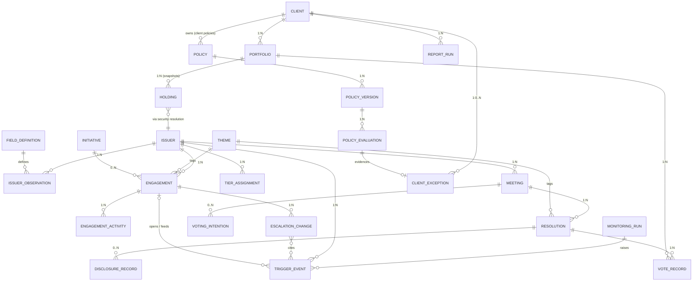
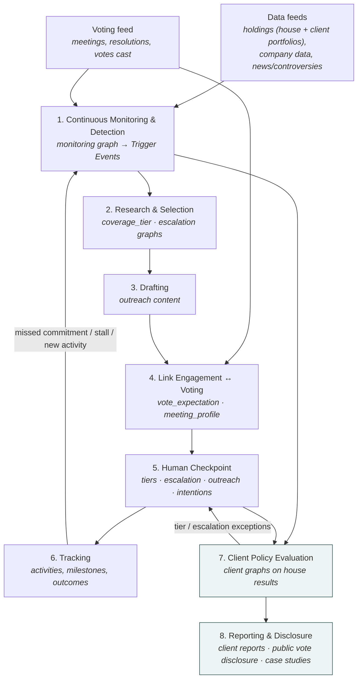
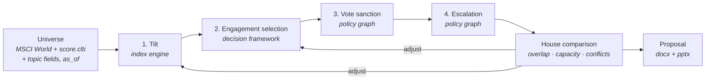
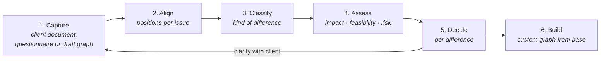

# Stewardship Automation — Data Model, Process Graph, and Process Activities

One data model, one process graph, and eight stages of activity. House truth is
written once per issuer, engagement or resolution. The client overlay only enters
at stages 7–8, and it stores only what differs from house truth.

**Status: target design, not yet implemented.**

## Design constraints

These are fixed inputs to the design. They are not open questions.

1. **Voting is consumed, never executed.** The votes cast arrive *after the fact*
   from an external source, and the tool never casts a vote. It publishes expected
   votes and voting intentions, reviews the votes actually cast against policy, and
   uses vote outcomes as engagement triggers. Meeting agendas (meetings and
   resolutions) arrive *ahead* of the meeting, which the pre-meeting features need
   (Part 6, E3).
2. **Escalation has many triggers.** A vote outcome is one of them. Controversies,
   score movements, missed commitments, stalled dialogue, calendar dates and manual
   input are others. The central (house) policy defines escalation logic, and so
   does every client policy.
3. **Company data is large and open-ended.** The model does not hardcode company
   attributes. CLTI, nature and any other score are placeholders: rows in a field
   catalogue, not columns.
4. **One rule engine.** House rules and client rules are both GoRules JSON Decision
   Model (JDM) graphs. They run on the ZEN engine and are edited in the existing
   rule-graph editor. There is no second rule language and no Python-only policy.

---

## Part 1 — The Data Model

Four layers:

- **Reference & company data** — who the issuers are and everything known about them.
- **House truth** — a coverage tier for every holding, engagements with their escalation step, and ingested voting facts, written once.
- **Policy** — versioned rule graphs, owned by the house or by a client, plus an
  audit row for every evaluation.
- **Client overlay** — clients, their portfolios, and *exceptions only*: rows where
  a client policy's result differs from the house result.

### Reference & company data

#### Issuer
A thin identity row. Everything descriptive or measured lives in observations.

| Field | Type | Notes |
|---|---|---|
| issuer_id | PK, string | The join key everywhere. Holdings reach it through the security→issuer resolution. |
| name, country, region, sector | string | Stable reference attributes only. `region` is derived from `country` by a mapping table. |

#### Field Definition
The catalogue of everything that can be known about an issuer. **New scores and
data sets are added here as rows, never as schema changes.**

| Field | Type | Notes |
|---|---|---|
| field_id | PK, string | Dotted, stable names, e.g. `score.clti`, `score.nature`, `governance.board_independence_pct`. This is the name rule graphs use. |
| label, category | string | `category` groups fields in the editor (score, governance, climate, controversy, …). |
| value_type, unit | enum, string | number \| text \| bool \| date. |
| source | string | Provider or pipeline that populates it. |

#### Issuer Observation
One value of one field for one issuer at one point in time. **Append-only**: a
correction is a new row with a later `observed_at`, so any past evaluation can be
reproduced from what was known then.

| Field | Type | Notes |
|---|---|---|
| issuer_id + field_id + period + observed_at | composite PK | |
| value | number \| text \| bool | Exactly one value; typed by the field definition. |
| source, confidence | string, decimal | |

The rule engine does not query this table directly. Evaluations use the **issuer
context**: the latest observation per field as of a given date, flattened into
`{"score": {"clti": 61.2, "nature": 44}, "governance": {...}}`. It is a derived
read, never stored as its own entity. At scale it becomes a materialised "latest
value" view.

#### Theme
A controlled vocabulary (e.g. `climate_transition`, `board_governance`,
`executive_compensation`). Engagements and resolutions both carry a `theme_id`.
Priority weights and the engagement↔vote link only work if both sides use the same
list, and free-text themes break both.

### House truth — client-agnostic, written once

#### Monitoring scope and Monitoring Run
Stage 1 continuously monitors **every issuer in scope**:

- the **house scope**: every issuer held in any in-scope portfolio, as of the
  monitoring date; and
- every **client portfolio**, including issuers only that client holds.

Scope is derived from the holdings snapshots at run time, not stored as its own
list: an issuer enters or leaves scope when it is bought or sold. Each scheduled
pass is recorded so every trigger can be traced back to the data it saw.

| Field | Type | Notes |
|---|---|---|
| run_id | PK | |
| as_of | date | Holdings snapshot date and observation cut-off. |
| portfolios | array → Portfolio | What was in scope for this run. |
| issuer_count, trigger_count | int | |
| policy_version | FK → Policy Version | The house `monitoring` graph used. |

Reading holdings is not a client *policy*: the monitoring run treats client
portfolios as data, so stages 1–6 still never read a client policy.

#### Coverage tier (E1)
Every issuer in scope gets **one of four coverage tiers**. The tier sets the depth
and the form of stewardship the issuer receives. It is a property of the
**issuer**, assigned to every holding, not only to companies under engagement.

| Tier | Form of engagement | Engagements it creates | Max escalation step (default) |
|---|---|---|---|
| Priority Bilateral | Bespoke, house-led dialogue with the company | One per issuer × theme, `mode = bilateral` | Full ladder |
| Thematic & Collaborative | Theme campaigns and collaborative initiatives with other investors | One per issuer × theme, `mode = collaborative`, linked to an Initiative | Escalation to the chair; anything beyond means promotion to Priority Bilateral |
| Scaled Baseline | Standard expectations letters and voting policy across the index | One per baseline Initiative, `mode = baseline` | Vote against management |
| Systemic / Market-Level | No company-specific dialogue; covered through market-level work (regulators, standard setters, index providers) and voting | None at issuer level; the issuer is counted under market-level Initiatives | — (voting only) |

The tier names come from the Full-Index Coverage model. The caps are proposed
defaults and are configuration. Reaching a tier's cap is itself a trigger to
consider promoting the issuer to the next tier.

| Tier Assignment | Type | Notes |
|---|---|---|
| issuer_id + assigned_at | composite PK | **Append-only**: re-evaluation writes a new row, so the tier history is kept. |
| tier | enum | priority_bilateral \| thematic_collaborative \| scaled_baseline \| systemic |
| evaluation_id | FK → Policy Evaluation | The `coverage_tier` evaluation, which records **which rule fired**: the stored justification. |
| inputs | JSON | Index weight, AUM held, prior engagement history, sector/thematic flags, as evaluated. |
| confirmed_by | string, nullable | Set when a person confirms a tier change at the checkpoint. |

Tiers are re-evaluated **at least quarterly** (a scheduled monitoring run) and
also when a trigger changes the inputs (a large holding change, a new
controversy). The tier distribution report is a query over the latest assignment
per issuer.

#### Initiative
Groups engagements that are run as one effort, and holds market-level work that
has no single issuer.

| Field | Type | Notes |
|---|---|---|
| initiative_id | PK | |
| type | enum | collaborative \| baseline_campaign \| market_level |
| theme_id | FK → Theme | |
| name, partners, started_at, status | | `partners` for collaborative initiatives (e.g. other investors). |

#### Escalation ladder
Within an engagement, escalation moves along a ladder of steps. The default is the
7-step ladder: private engagement → joint engagement → written escalation to the
board → escalation to the chair → **vote against management** → file or co-file a
resolution → public statement. The steps are configuration, and the issuer's tier
caps how far an engagement can go (table above).

#### Engagement

| Field | Type | Notes |
|---|---|---|
| engagement_id | PK, string | One per issuer × theme dialogue. |
| issuer_id | FK → Issuer | 1 : N. |
| theme_id | FK → Theme | |
| mode | enum | bilateral \| collaborative \| baseline, set by the issuer's tier. |
| initiative_id | FK → Initiative, nullable | For collaborative and baseline engagements. |
| escalation_step | int | Position on the ladder. Written only through Escalation Change. |
| status, milestone | enum | open \| stalled \| resolved \| closed; the milestone ladder (progress of the dialogue itself) is configuration. |
| opened_by_trigger_id | FK → Trigger Event | Why it exists. |

#### Engagement Activity
Append-only log of outreach, meetings, responses and commitments. It replaces the
`outreach_history` array, so each item can be queried, dated and attributed.

| Field | Type | Notes |
|---|---|---|
| activity_id | PK | |
| engagement_id | FK → Engagement | |
| type | enum | letter \| call \| meeting \| response \| commitment \| commitment_verified \| commitment_missed |
| occurred_at, summary, doc_ref, logged_by | | |
| target_date | date, nullable | For commitments; a missed date raises a trigger. |
| interaction_type | enum | informational \| advocacy_pressure \| other (E6). Required on every call, letter and meeting. |
| status | enum | draft \| approved \| sent (or scheduled). An `advocacy_pressure` item cannot leave `draft` without checkpoint approval (E6). |
| provenance | Provenance, nullable | Required for AI-generated drafts and research notes (E5). |

#### Trigger Event
Every reason something might need attention, in one table. **This is where
escalation's many triggers converge**, and where voting feeds engagement.

| Field | Type | Notes |
|---|---|---|
| trigger_id | PK | |
| issuer_id | FK → Issuer | |
| type | enum | vote_outcome \| controversy \| score_change \| holding_change \| commitment_missed \| engagement_stalled \| calendar \| manual |
| theme_id | FK → Theme, nullable | |
| engagement_id | FK, nullable | Set when the trigger is matched to an open engagement. |
| subject_ref | string, nullable | What it points at, e.g. a `resolution_id` for vote outcomes or a `field_id` for score changes. |
| payload | JSON | Type-specific facts (support %, old/new score, controversy severity, …). |
| run_id | FK → Monitoring Run, nullable | Set when raised by a monitoring pass. |
| detected_at, source | | |

#### Escalation Change
Append-only history of every move on the ladder, up or down. A vote is one
possible *trigger* for a change, and "vote against management" is the step where a
vote becomes the *lever*. The change always belongs to the engagement, never to a
resolution.

| Field | Type | Notes |
|---|---|---|
| engagement_id + seq | composite PK | |
| from_step, to_step | int | |
| trigger_ids | array → Trigger Event | What prompted it. |
| recommended_by_evaluation_id | FK → Policy Evaluation | The house `escalation` recommendation. |
| decided_by, decided_at, note | | **Human checkpoint.** A change exists only once a person decides it. |

#### Provenance (E5)
Attached to **every AI-generated finding, draft or recommendation**: research
notes, outreach drafts, voting-intention drafts, disclosure rationales, case
studies. Policy results carry their own trail in Policy Evaluation.

| Field | Type | Notes |
|---|---|---|
| source_refs | array | Document id + location for each claim, from the existing citation grounding (quotes are checked against the source text). |
| evaluation_ids | array → Policy Evaluation | The rules that led here (e.g. the tier, escalation or vote expectation that prompted the draft), each with its `fired_rules`. |
| model, model_version, prompt_version | string | What generated the text. |
| generated_at | timestamp | |

**Gate:** an item with empty provenance cannot be submitted to the human
checkpoint. Given any recommendation, the chain source → rule → evaluation →
draft → decision is a set of lookups, not a reconstruction.

#### Meeting / Resolution / Vote Record — ingested, read-only
All three are loaded from the external voting source after the event. Nothing in
the tool writes them except the ingestion job.

| Meeting | Type | Notes |
|---|---|---|
| meeting_id | PK | **Natural key**: `issuer_id + meeting_date + meeting_type`. Re-ingesting the same file gives the same IDs. |
| issuer_id, meeting_date, meeting_type | | AGM \| EGM. |

| Resolution | Type | Notes |
|---|---|---|
| resolution_id | PK | Natural key: `meeting_id + item_number`. |
| item_number, text, category, proponent | | category: director election, say-on-pay, auditor, shareholder proposal, … |
| theme_id | FK → Theme | Assigned at ingestion (mapping table from category, then manual correction). |
| management_recommendation | enum | |
| house_recommendation, house_rationale | enum, string | As supplied by the source. |
| outcome, support_pct | enum, decimal | Meeting result, once known. |

| Vote Record | Type | Notes |
|---|---|---|
| resolution_id + portfolio_id | composite PK | The grain is **portfolio × resolution**, because split and pass-through votes differ per portfolio. |
| vote_cast | enum | for \| against \| abstain \| withhold \| not_voted |
| voted_by | enum | house \| client (pass-through) |
| rationale | string, nullable | |
| source_batch_id | string | Which ingestion file it came from. |

Meetings and resolutions are needed **before** the meeting for voting intentions
and vote expectations (E3, stage 4), so the feed has two parts: the agenda
(meetings and resolutions, ahead of time) and the votes cast (after the event).
The tool still never casts a vote.

| Meeting (addition) | Type | Notes |
|---|---|---|
| high_profile, high_profile_evaluation_id | bool, FK → Policy Evaluation | From the `meeting_profile` graph (E3); the evaluation stores which rule flagged it. |

#### Voting Intention (E3)
A pre-meeting statement of how the house intends to vote, published for
high-profile meetings.

| Field | Type | Notes |
|---|---|---|
| intention_id | PK | |
| meeting_id | FK → Meeting | |
| statement, per_resolution | text, JSON | Drafted from the `vote_expectation` results. |
| trigger_evaluation_id | FK → Policy Evaluation | The `meeting_profile` rule that flagged the meeting. |
| due_at | date | N business days before the meeting (configuration). |
| status, approved_by, published_at | | draft → approved → published. **Human checkpoint** before publication. |
| provenance | Provenance | |

#### Disclosure Record (E2)
The publishable, per-company record of each house vote. It is written by the
house, **separate from the ingested vote**, so the ingested fact stays untouched.

| Field | Type | Notes |
|---|---|---|
| resolution_id + vote_cast | composite PK | One record per distinct house vote on a resolution (usually one). |
| issuer, meeting_date, proposal_text, vote_cast | | Denormalised for publication. |
| against_management | bool | |
| rationale | text | Taken from the feed when present, otherwise drafted from the `vote_expectation` rationale. **Required when `against_management`: the record cannot be finalised without it.** |
| status, finalised_by, finalised_at | | draft → final. |
| published_in | array | Export batches (JSON, HTML/PDF) that contained it. |

Disclosure records are frozen once final. A later change to a mandate's voting
policy (E4) never touches them.

### Policy — one engine, house and clients alike

#### Policy / Policy Version

| Policy | Type | Notes |
|---|---|---|
| policy_id | PK | |
| owner | enum + FK | `house`, or `client` + client_id. |
| domain | enum | monitoring \| coverage_tier \| escalation \| vote_expectation \| meeting_profile (extensible). |
| menu_name | string, nullable | Set for house `vote_expectation` policies offered on the voting-policy menu (E4). |
| base_policy_id + base_version | FK → Policy Version, nullable | For a custom client policy: the menu policy (or house policy) it was derived from. |
| active_version | int | |

| Policy Version | Type | Notes |
|---|---|---|
| policy_id + version | composite PK | **Immutable** once saved; an edit is a new version. |
| graph | JSON | A JDM graph, evaluated by ZEN, edited in the rule-graph editor. |
| effective_from, approved_by, approved_at | | Nothing evaluates against an unapproved version. |

**Every domain has a fixed input/output contract**, so any graph for that domain
(house or client) is interchangeable:

| Domain | Evaluated per | Input context | Output |
|---|---|---|---|
| monitoring | issuer in scope, each monitoring run | `issuer` (context, incl. change since the last run), `holding` (weight, change in weight, which portfolios hold it) | `triggers`: list of {type, theme, severity, detail} |
| coverage_tier | issuer in scope, quarterly and on relevant triggers | `issuer`, `holding` (index weight, AUM held across portfolios), `history` (prior engagements, outcomes), sector/thematic flags, `selection` (score, tier and leverage from the decision framework, if attached) | `tier`, `themes` (for bilateral/collaborative), `reason` |
| escalation | open engagement with new triggers | `issuer`, `engagement` (mode, step, milestone, months at step, commitments), `tier` (incl. its step cap), `triggers` | `recommended_step`, `promote_tier` (bool), `reason` |
| vote_expectation | resolution (before the meeting) and vote record (once ingested) | `issuer`, `resolution`, `engagement` (step, theme), `tier`, `portfolio`, `vote` (null before the meeting) | `expected_vote`, `consistent` (null before the meeting), `rationale`, `reason` |
| meeting_profile | upcoming meeting | `issuer`, `meeting` (contested, activist campaign), `holding` (rank by weight), media-attention signal | `high_profile` (bool), `reason` |

`coverage_tier` is selection: it decides who gets which depth of engagement.
`escalation` moves an existing engagement along the ladder. `vote_expectation`
evaluated before a meeting gives the expected votes (including sanctions for
engagements at the vote-against-management step); evaluated after ingestion, it
checks the vote that was actually cast.

**ZEN evaluation trace.** Each evaluation stores the rule-table rows that fired,
read from the engine's trace, so "which rule fired" is recorded, not reconstructed.

**House → client chaining.** A client graph is evaluated with the house result in
its input under `house.*`. A client that agrees with the house simply returns
`house.*`; a client with a stricter rule overrides one field. That is how a client's
tiering preferences and escalation rules are expressed: as small graphs that start
from the house answer. They are not a separate delta format. A client with no
policy for a domain inherits the house result.

**Voting: menu or custom (E4).** Each mandate has exactly one voting policy
(Portfolio `voting_policy_id`, with an effective date), from one of two sources:

- **Menu** — one of 3–4 named house policies (house-owned, with a `menu_name`).
  This is the standard offer: narrow, defensible, no design work.
- **Custom** — a client-owned `vote_expectation` policy that the house designs
  **with** the client (Part 5.2). It starts as a copy of a menu policy
  (`base_policy_id`) and changes only what the client needs, so every deviation
  from the menu is visible as a diff between two graphs.

Both are ordinary policies on the same engine, so everything downstream (expected
votes, consistency checks, disclosure, reporting) treats them the same way. Custom
client graphs are equally available for `coverage_tier` and `escalation`.

#### Policy Evaluation
The audit trail. It makes every recommendation, exception and report number
traceable to a rule version and its inputs.

| Field | Type | Notes |
|---|---|---|
| evaluation_id | PK | |
| policy_id + version | FK → Policy Version | |
| subject_type, subject_id | enum, string | issuer \| issuer_theme \| engagement \| resolution \| vote_record. |
| as_of | date | Observation cut-off used for the issuer context. |
| input_hash, output | string, JSON | The full input can be rebuilt from `as_of`, so only its hash is stored. |
| fired_rules | array | Node and rule-row ids from the ZEN trace: the exact clause that produced the output. |
| evaluated_at | timestamp | |

### Client overlay — thin, per client

#### Client

| Field | Type | Notes |
|---|---|---|
| client_id | PK | |
| name | string | |
| reporting_template_ref | FK → report template | Existing Report Builder templates. |

The old *Client Policy Profile* is not an entity any more. It is simply the set of
`POLICY` rows the client owns, plus this template reference.

#### Portfolio / Holding

| Portfolio | Type | Notes |
|---|---|---|
| portfolio_id | PK | |
| client_id | FK → Client | 1 : N. |
| vehicle_type | enum | SMA \| CCF \| ETF |
| voting_mode | enum | house_voted \| pass_through. Part of the vote_expectation input. |
| voting_policy_id, voting_policy_effective_from | FK → Policy, date | The menu or custom voting policy of this mandate (E4). A change applies to meetings after the effective date only. |

Holdings keep the existing shape: immutable snapshots keyed by
`portfolio_id + security_id + as_of_date`, with the issuer reached through the
security→issuer resolution. Sector is read from the Issuer, not copied onto each row.

#### Client Exception
The whole stored overlay. **A row exists only where a client policy's output
differs from the house output**, so most clients have zero rows for most subjects,
and adding a client never touches house data.

| Field | Type | Notes |
|---|---|---|
| client_id + domain + subject_id | composite PK | subject = issuer_id, engagement_id, or resolution_id + portfolio_id. |
| evaluation_id | FK → Policy Evaluation | The client evaluation that produced it. |
| house_evaluation_id | FK → Policy Evaluation | What it deviates from. |
| kind | enum | tier_higher \| tier_lower \| escalation_higher \| vote_expectation_differs \| vote_inconsistent |
| detail | JSON | e.g. `{"house_tier": "scaled_baseline", "client_tier": "priority_bilateral"}`. |
| status | enum | open \| acknowledged \| raised_to_house |

The house engages each company once, so a client cannot run its own dialogue. A
client tier or escalation step above the house's (including an issuer only that
client holds) becomes a `tier_higher` or `escalation_higher` exception that is
(a) shown at the house human checkpoint, where the house can adopt it, and
(b) reported to the client either way. A vote expectation that differs from the
house comes from the mandate's voting policy (menu or custom); it only affects that client's
portfolios and is deliverable only where the client's shares can be voted
separately (Part 5.3).

#### Report Run
Reports are rendered from data at generation time and are not stored content. Only
the facts needed to reproduce and audit them are kept.

| Field | Type | Notes |
|---|---|---|
| report_id | PK | |
| client_id | FK → Client | |
| period_start, period_end | date | Filters activities, steps, votes and triggers by date. |
| as_of | date | Observation cut-off. |
| policy_versions | array | Exact versions used, so the report can be regenerated identically. |
| status | enum | draft \| approved \| sent. |
| approved_by, approved_at | | **Human checkpoint**: compliance/legal. |
| delivery_log | array | recipient, channel, sent_at. |

---

## Part 2 — The Process Graph

Stage 1 runs continuously over everything in scope. Stages 2–6 act on the issuers
it surfaces, using house policies only. Stages 7–8 add client policies.

---

## Part 3 — Process Activities

### 1. Continuous Monitoring & Detection
Runs on a schedule (daily for news and controversies, on each holdings or data
refresh otherwise) over the full monitoring scope.

- Take the latest holdings snapshot of **all in-scope house portfolios and every
  client portfolio**; the union of their issuers is the scope for this run.
- Refresh the issuer context for each issuer: holdings and weight changes, scores,
  controversies and any other observed field.
- Evaluate the house `monitoring` graph per issuer and write a Trigger Event for
  each output: a score crossing a threshold, a new or worsening controversy, a
  large holding change, a vote outcome from the voting feed, a missed commitment,
  a stalled engagement, a calendar date.
- Attach each trigger to an open engagement on the same issuer + theme where one
  exists. Triggers on issuers with no engagement make them selection candidates.

**Reads:** Portfolio, Holding (house and client portfolios), Issuer, Issuer Observation, Resolution, Vote Record, Engagement, Engagement Activity
**Writes:** Monitoring Run, Trigger Event
**Human checkpoint:** —

### 2. Research & Selection
- **Tiering (selection).** Evaluate the house `coverage_tier` graph for every issuer
  whose inputs changed, and for all issuers at the quarterly re-evaluation. Write a
  Tier Assignment with the rule that fired. A changed tier is proposed; the
  checkpoint confirms it.
- **Engagements.** For Priority Bilateral and Thematic & Collaborative issuers,
  open an engagement for each theme the tier output names (collaborative ones linked
  to their Initiative). Scaled Baseline issuers join the baseline campaign
  engagement. Systemic issuers get no issuer-level engagement.
- **Escalation.** For open engagements with new triggers, evaluate the house
  `escalation` graph, capped by the issuer's tier. Reaching the cap sets
  `promote_tier`.
- **Research.** For every new engagement and every proposed escalation, compile the
  dossier: company context, prior engagements and outcomes, triggers, and past votes
  on the same theme. Every finding carries its provenance (E5).

**Reads:** Policy Version (house `coverage_tier`, `escalation`), issuer context, Holding, Trigger Event, Engagement, Engagement Activity, Resolution, Vote Record, decision framework results
**Writes:** Policy Evaluation, Tier Assignment (proposed), Engagement (create), Engagement Activity (research note)
**Human checkpoint:** —

### 3. Drafting
- Prepare outreach content for the engagement. There is no vote drafting, because
  votes are consumed only.
- Tag every draft interaction as informational, advocacy/pressure or other (E6).
  The drafting agent proposes the tag; the checkpoint can change it.
- Attach provenance to every draft (E5).

**Reads:** Engagement, Engagement Activity, issuer context
**Writes:** Engagement Activity (draft)
**Human checkpoint:** before any outreach is sent (a draft only becomes a `letter`
activity once a person has sent it).

### 4. Link Engagement ↔ Voting
- For upcoming meetings, evaluate `meeting_profile`. A high-profile meeting gets a
  **draft Voting Intention** N business days before the meeting (E3).
- For upcoming meetings, evaluate `vote_expectation` per resolution, once with the
  house policy and once per voting policy in use by a mandate (menu or custom). This gives the expected
  votes, including sanctions for engagements at the vote-against-management step. It
  is published to whoever votes; the tool never casts a vote.
- For newly ingested vote records, evaluate `vote_expectation` again and record
  whether the vote cast was consistent. An inconsistent vote on an engagement at the
  vote-against-management step, or a failed or low-support vote, becomes a Trigger
  Event. Each house vote gets a Disclosure Record (E2).

**Reads:** Policy Version (house `vote_expectation`, mandate voting policies, `meeting_profile`), Engagement, Tier Assignment, Meeting, Resolution, Vote Record, Portfolio
**Writes:** Policy Evaluation, Trigger Event, Voting Intention (draft), Disclosure Record (draft)
**Human checkpoint:** —

### 5. Human Checkpoint
- Confirm tier changes and escalation changes proposed in stage 2, including
  promotions, plus `tier_higher` and `escalation_higher` exceptions raised by clients.
- Approve voting intentions before publication (E3).
- Authorise outreach before anything is sent or scheduled. **Advocacy/pressure
  interactions always stop here (E6).**
- Complete and approve disclosure records. A vote against management cannot be
  finalised without a rationale (E2).
- Nothing reaches this stage without provenance attached (E5).

**Reads:** Policy Evaluation, Tier Assignment, Engagement, Client Exception (raised_to_house), drafts, Voting Intention, Disclosure Record
**Writes:** Tier Assignment (confirmed_by), Escalation Change, Engagement (escalation_step), Engagement Activity, Voting Intention (approved), Disclosure Record (final)
**Human checkpoint:** this stage.

### 6. Tracking
- Log activities, commitments and their outcomes; update engagement status and
  milestone. Missed dates and stalls go back to stage 1 as triggers.

**Reads:** Engagement, Engagement Activity
**Writes:** Engagement (status, milestone), Engagement Activity
**Human checkpoint:** commitments are logged only once a person has validated them.

### 7. Client Policy Evaluation *(client overlay)*
- For each client, evaluate the client's `coverage_tier` and `escalation` graphs
  over **the client's own portfolio** (every issuer they hold, including ones outside
  the house scope), with the house result under `house.*`.
- Evaluate `vote_expectation` for the client's portfolios using each mandate's
  voting policy (menu or custom).
- Write a Client Exception wherever the output differs from the house. Raise
  `tier_higher` and `escalation_higher` exceptions to the house checkpoint (stage 5).

**Reads:** Policy Version (client), Policy Evaluation (house), issuer context, Portfolio, Holding, Vote Record
**Writes:** Policy Evaluation (client), Client Exception
**Human checkpoint:** —

### 8. Reporting & Disclosure *(client overlay + public)*
- **Client reports.** For the period: the client's holdings and their tier
  distribution, engagements relevant to them with escalation changes, votes cast in
  their portfolios with consistency against their voting policy, and their
  exceptions, rendered through the client's template.
- **Public vote disclosure (E2).** Export final Disclosure Records per meeting and
  period as JSON and as a human-readable HTML/PDF view, with no manual reformatting.
- **Case studies (E7).** For each engagement whose escalation sequence is closed,
  draft a case study from its records: initial issue and trigger, engagement steps
  with dates, highest escalation step reached, votes cast along the way, final
  outcome, and disclosure references. Plain language, with provenance.
- **Style check (E8).** Every client-facing text (reports, case studies, disclosure
  summaries, intentions) is checked against the phrase blocklist before the
  checkpoint. Matches are flagged with phrase and location for rewrite, never
  removed automatically.

**Reads:** everything above, filtered by client, period and as_of; Disclosure Record; Escalation Change; Engagement Activity
**Writes:** Report Run, delivery_log, Disclosure Record (published_in), case-study drafts
**Human checkpoint:** compliance/legal approval before anything is sent or published.

---

**The pattern to notice:** stages 1–6 never read a client policy or write a client
row. Onboarding a client means adding a Client, its Portfolios and, optionally,
its Policy graphs. With no graphs, the client inherits every house result and
generates zero exceptions.

---

## Part 4 — Building on the existing code

| Need | Reuse |
|---|---|
| Rule evaluation | `arp/decision/rules.py::evaluate_rows` (ZEN 2.0.2, batch evaluation). The same engine build runs in the browser for live preview. |
| Rule editing | `frontend/src/components/RuleGraphEditor.tsx` + `lib/zenEngine.ts`. |
| Immutable versions + approval | `arp/storage/decision_store.py` pattern (`new_version`, `ratify`, per-version audit). |
| Append-only observations | `DataPointObservation` + `PortfolioStore.latest_observation(as_of=...)` in `arp/schemas/portfolio.py`: already the Issuer Observation shape. |
| Holdings, security→issuer | `Holding`, `SecurityResolution`, `PortfolioStore` snapshots. |
| Report templates, docx/pptx output | `arp/storage/reporting_store.py`, `arp/reporting/` (Report Builder). |
| Portfolio tilting | `arp/index/` (`metric_tilt`, constraints, TE budget, versioned calibrations). |
| Target selection by leverage | `arp/decision/` (scoring, `tier_graph`, leverage = size × gap). |
| Alerts and scheduling | `arp/portfolio/monitoring/` (`evaluator.py`, `scheduler.py`). |
| Postgres at volume | existing projection pattern in `arp/storage/postgres_*_projection.py`. |

**Storage split.** Small, versioned configuration (policies, clients, themes, field
catalogue) goes in JSON file stores, like `DecisionStore`. High-volume facts
(observations, vote records, trigger events, evaluations) go in Postgres, which the
issuer context and report queries read.

## Part 5 — Client program design, calibration and monitoring

**Scenario.** The house stewardship program runs. A client wants their own
program on an MSCI World portfolio:

1. **Tilt**: over-weight CLTI leaders and under-weight laggards.
2. **Select**: pick engagement targets from the CLTI assessment plus other topics.
3. **Sanction**: for some targets, set a vote sanction at the next AGM.
4. **Escalate**: for some targets, escalate further.

The tool has to let an analyst calibrate all four steps for this client's portfolio
and objective, and check them against the house program for efficiency and
feasibility. It then produces a documented program proposal and a PPT. Once the
client approves, the same definition drives monitoring.

### 5.1 The program as a versioned bundle

A client program is **a set of references to calibrations that already exist**,
plus the client's objective. It is not new logic.

| Step | Engine that does it | Where it lives |
|---|---|---|
| 1. Tilt | Index engine: `metric_tilt` on `score.clti` (rank_percentile or z-score, `[floor, ceiling]` multipliers), constraints and tracking-error budget | `arp/index/` (versioned calibrations in `index_store.py`) |
| 2. Engagement selection | Decision mechanism scores on CLTI + other topic columns, tiers by `tier_graph` and ranks by **leverage** (position size × gap to a perfect score); the client's `coverage_tier` graph turns that into a coverage tier | `arp/decision/` + ZEN graph, Part 1 policy layer |
| 3. Vote sanction | Targets at the vote-against-management step; the mandate's voting policy (a menu item, or a custom policy designed with the client, below) says *which vote the program expects* at the next AGM (e.g. against the chair or the say-on-pay) | ZEN graph, Part 1 policy layer |
| 4. Escalation | The client's `escalation` graph (chained on the house one), capped by tier | ZEN graph, Part 1 policy layer |
| Proposal + PPT | Report Builder: datasets → content plan → `pptx` / `docx` | `arp/reporting/` |
| Monitoring | Portfolio alert rules + scheduler, plus stage 7 client exceptions | `arp/portfolio/monitoring/` |

Votes are still consumed only (design constraint 1). A **vote sanction is an
expectation**. The program publishes the sanction list to whoever votes, and the
tool then checks the ingested votes against it. It never instructs or casts a vote.

New entities (additions to Part 1):

| Entity | Key fields | Notes |
|---|---|---|
| CLIENT_PROGRAM | program_id, client_id, portfolio_id, benchmark (`MSCI World`), objective, status | draft → proposed → approved → live → retired. |
| PROGRAM_VERSION | program_id + version, `index_calibration` (id+version), `decision_framework` (id+version), `policy_versions` {coverage_tier, escalation, vote_expectation}, `capacity` assumptions, approved_by | **Immutable.** Recalibrating makes a new version, so what was proposed, approved and monitored is always exactly reproducible. |
| PROGRAM_SIMULATION | simulation_id, program_id + version, as_of, outputs (below), house_comparison | One per "Run" click in the calibration loop. Cheap to throw away; the version the client approves points at its simulation. |
| PROGRAM_TARGET | program_id + version, issuer_id, theme_id, role, tier, max_step, origin | role: overweight \| underweight \| engage; `tier` from the four coverage tiers and `max_step` the planned escalation ceiling (vote against management = sanction). origin: `house` (already in the house program) \| `client_only`. Frozen at approval; this is the monitored list. |
| PROGRAM_KPI_SNAPSHOT | program_id, as_of, kpis (JSON) | One row per monitoring run; the time series behind the monitoring view. |

### 5.2 Calibration loop

One page, one pipeline, rerun on every change. Each step shows its outputs *and*
the house comparison, so the analyst sees the cost of a setting immediately.

| Step | The analyst sets | The tool shows |
|---|---|---|
| Universe | benchmark, as_of, which topic fields to use | coverage of `score.clti` and each topic field across the benchmark; names with no score (handled by the index engine's `missing` policy) |
| 1. Tilt | normalisation, floor/ceiling, TE budget, sector/country caps | active weights of the leaders and laggards, weighted CLTI uplift vs benchmark, tracking error, turnover vs last version |
| 2. Selection | criteria and weights, tier cut-points or tier graph, max targets | the ranked target list by leverage, why each name is in, tier sensitivity (does the list survive a weight change?) |
| 3. Sanction | graph, e.g. `tier == 1 and no_progress_months >= 12 → against chair` | sanction list per upcoming AGM, and where it contradicts the house recommendation |
| 3–4. Sanction & escalation | voting policy (menu item or custom, below); the client's `escalation` graph, chained on the house result | names where the client's tier or step is above the house's |

#### Designing a custom policy with the client
The same loop is how the house helps a client design their own policy, for voting
as well as for tiering and escalation.

0. **Review first.** Run a policy review (5.7) on what the client envisions; the
   decided differences are what gets built.
1. **Start from a base.** Copy the closest menu policy (or the house policy) into a
   client-owned draft. The draft records its base.
2. **Change only what the client needs**, in the rule editor: e.g. vote against the
   chair where `score.clti` is in the bottom decile and the engagement has made no
   progress for 12 months.
3. **Back-test** the draft on past seasons of ingested meetings, resolutions and
   votes, and on upcoming agendas for the client's holdings. The tool shows:
   - how many resolutions the draft decides differently from the base, and from the
     house, broken down by resolution category and theme;
   - the rate of votes against management;
   - which past house votes the draft would have contradicted (the split-vote need);
   - for each difference, the rule row that caused it (from the ZEN trace).
4. **Review the differences** with the client in a structured policy review
   (5.7): each difference from the house policy, classified, assessed and decided,
   with its back-test effect. This diff is a section of the program proposal (5.4).
5. **Approve.** Both the client and the house sign off on the version. It then
   applies from its effective date. Earlier votes and disclosures stay as they were.

If several clients converge on similar custom policies, promote the pattern to a
new menu item.

### 5.3 House comparison — efficiency and feasibility

This is the reason to calibrate *against* the house program and not in isolation.
Each check is computed from the simulation and shown as a traffic light.

| Check | Computed as | Why it matters |
|---|---|---|
| Engagement overlap | share of client targets already in a house engagement (same issuer + theme) | Overlap costs nothing extra: the client joins an existing dialogue. |
| Marginal workload | client-only targets × effort per engagement (capacity assumption) vs free house capacity | The key feasibility number: can the team actually deliver the program? |
| Theme gap | client targets on themes the house does not cover | Needs new expertise; flag it, do not hide it. |
| Vote conflicts | sanctions, and custom-policy expected votes, where the house recommendation differs | Only deliverable if the client's shares can be voted separately. **Feasible in an SMA; not in a pooled CCF/ETF**, which must vote one way. Checked against `Portfolio.vehicle_type`. |
| Tier and escalation conflicts | client tier or step > house tier or step on the same issuer | One company, one dialogue: the house has to agree to escalate, or the proposal says it won't. |
| Tilt vs engagement coherence | engagement targets that the tilt has sold down to near zero | Leverage falls with the position; engaging a company the portfolio barely holds is weak. |

### 5.4 Proposal and PPT

Generated from the approved simulation through the Report Builder, so every number
in the document comes from the recorded run.

Sections, identical in the docx and the deck:

1. Client objective and the program in one page.
2. Tilt: method, leaders/laggards, CLTI uplift, tracking error, top active weights.
3. Engagement: target list, selection logic, overlap with the house program.
4. Voting: the mandate's voting policy (menu item, or custom policy with its diff to the base and the back-test), expected sanctions next season, split-vote feasibility.
5. Escalation: ladder, client-specific triggers, conflicts with the house.
6. Feasibility: workload vs capacity and every red/amber check from 5.3, with the
   mitigation chosen.
7. Monitoring: the KPIs and alert thresholds below, and the reporting cadence.
8. Appendix: rule versions, data as_of, full target list.

Each simulation result becomes a Report Builder `QuantitativeDataset` (tables and
charts), and the proposal is one Report Builder request against the client's
template.

### 5.5 Monitoring once live

The approved PROGRAM_VERSION is what gets monitored. A scheduled run (existing
monitoring scheduler) writes a PROGRAM_KPI_SNAPSHOT and raises alerts through the
existing alert rules:

| KPI | Alert when |
|---|---|
| Weighted CLTI vs benchmark | uplift falls below the proposal's target |
| Tracking error, active weight drift | above budget |
| Target membership | a new name qualifies or a target no longer qualifies (the proposal reruns on fresh data) |
| Engagement progress per target | milestone stalled beyond SLA (raises a Trigger Event) |
| Sanction conformance | an ingested vote on a sanctioned resolution does not match the expected vote (becomes a Client Exception) |
| Escalation status | a client-only escalation is waiting on a house decision |

Recalibration is a new program version with its own simulation and proposal.
Monitoring switches to the new version only when it is approved.

### 5.6 Build order

| Phase | Delivers | Effort (rough) |
|---|---|---|
| A | Program, version and target entities; a simulation that runs tilt → selection → sanction → escalation through the existing engines on MSCI World; house comparison | 4–6 days |
| B | Calibration page (one screen, reusing the index-builder, decision-studio and rule-editor components) | 4–6 days |
| C | Proposal: datasets + one Report Builder request producing docx and pptx | 2–3 days |
| D | Monitoring: KPI snapshots, alert rules, sanction conformance on ingested votes | 3–4 days |

Phase A is testable from the API alone, and it is where the design gets proven
before any UI is built.

### 5.7 Policy review — custom policy vs house policy

**Purpose.** Before a custom policy is built, compare what the client *envisions*
with the house policy, and turn the comparison into a structured list of
differences. Each difference is then assessed and decided on its own. The review
answers three questions: where exactly does the client deviate, what does each
deviation cost or risk, and which deviations do we implement.

It works for voting policies first. Tiering and escalation policies use the same
structure with their own issue catalogue.

#### A common language: the policy issue catalogue
Two policies can only be compared point by point if both are written in the same
terms. The review therefore expresses **both** policies as positions on a shared
catalogue of issues:

| Policy Issue | Type | Notes |
|---|---|---|
| issue_id | PK | e.g. `board.independence`, `board.overboarding`, `pay.say_on_pay`, `audit.non_audit_fees`, `climate.laggard_accountability`, `shp.climate_proposals`. |
| category | enum | board \| remuneration \| audit \| capital \| shareholder_proposals \| climate \| nature \| social \| other |
| resolution_categories | array | Which resolution types the issue governs. Used to count affected resolutions. |
| parameters | typed map | The parameters a position can set (number, bool, enum, map, or a field reference), e.g. `min_independent_pct` (number, %). |
| vote_targets | array | What a position on this issue can vote against, e.g. `nomination_committee_chair`, `say_on_pay`. |
| data_fields | array → Field Definition | Company data the issue needs (e.g. `score.clti`, `governance.board_independence_pct`). |

| Policy Position | Type | Notes |
|---|---|---|
| position_id | PK | |
| owner | policy version, or client source document | A house policy version, or the client's envisioned policy before any graph exists. |
| issue_id | FK → Policy Issue | |
| action, vote_target | enum, string | for \| against \| abstain \| case_by_case \| escalate; the target from the issue's `vote_targets`. |
| parameters | JSON | Validated against the issue's parameter schema. |
| scope | JSON | Markets, sectors, index membership, holding size. |
| source_ref | quote + location | The sentence in the policy text the position comes from (grounded). |
| implemented_by | array | Rule-row ids in the policy graph that implement it. |

**House positions are maintained once**, alongside the house graph. A consistency
check flags any position without implementing rules and any rule row without a
position, so the written policy and the executable one cannot drift apart. The
menu policies (not yet defined) should be written in the same catalogue from the
start.

#### Generic draft catalogue
There is no written house voting policy yet, so the catalogue starts as a
**generic draft** covering the issues common to institutional voting policies:
46 issues in 11 categories. It is not a house policy. It defines what a policy can
take a position on, not which position it takes.

The source of truth is
[`backend/arp/stewardship/data/policy_issue_catalogue.json`](../backend/arp/stewardship/data/policy_issue_catalogue.json).
It holds, per issue, the parameters with types and units, the resolution
categories it governs, the allowed vote targets, and the company data fields it
needs. The data fields are placeholders until the field catalogue exists. The table
below is generated from that file and the draft house positions.

| Issue | What it governs | Draft house position |
|---|---|---|
| `board.independence` | Minimum share of independent directors on the board. | **against** `nomination_committee_chair` — `min_independent_pct` 50; `controlled_company_min_pct` 33 |
| `board.committee_independence` | Independence of audit, remuneration and nomination committees. | **against** `non_independent_committee_members` — `audit_min_independent_pct` 100; `remuneration_min_independent_pct` 50; `nomination_min_independent_pct` 50 |
| `board.chair_ceo_separation` | Whether the chair and CEO roles must be split, and what mitigates a combined role. | **against** `combined_chair_ceo` — `require_separation` no; `accept_lead_independent_director` yes; `oppose_former_ceo_as_chair` yes |
| `board.overboarding` | Limits on the number of board mandates a director may hold. | **against** `overboarded_director` — `max_mandates_non_executive` 5; `max_mandates_executive` 1; `chair_counts_as` 2 |
| `board.attendance` | Minimum attendance of board and committee meetings. | **against** `low_attendance_director` — `min_attendance_pct` 75 |
| `board.gender_diversity` | Minimum representation of the under-represented gender. | **against** `nomination_committee_chair` — `min_underrepresented_gender_pct` 30; `markets_with_higher_threshold` EU→40 |
| `board.tenure_refreshment` | Tenure after which a director stops counting as independent, and board refreshment. | **against** `nomination_committee_chair` — `max_tenure_for_independence_years` 12; `max_average_tenure_years` 10 |
| `board.election_practices` | Annual, individual and majority-vote director elections. | **against** `nomination_committee_chair` — `require_annual_election` yes; `oppose_bundled_elections` yes; `require_majority_voting` yes |
| `board.responsiveness` | Action when the board ignores significant prior-year dissent or majority-supported proposals. | **against** `committee_chair_responsible` — `dissent_threshold_pct` 20; `ignore_majority_proposal` yes |
| `pay.say_on_pay` | Default approach to the remuneration report vote. | **case_by_case** `say_on_pay` — `default_action` against_on_red_flag |
| `pay.quantum` | CEO pay level relative to peers and to the workforce. | **against** `say_on_pay` — `max_peer_percentile` 90; `max_ceo_worker_pay_ratio` not set |
| `pay.performance_alignment` | Alignment of realised pay with shareholder returns and performance conditions. | **against** `say_on_pay` — `max_misalignment_years` 3; `min_long_term_share_pct` 50; `min_vesting_period_years` 3 |
| `pay.esg_metrics` | Whether variable pay must include measurable sustainability (e.g. climate) targets. | **against** `remuneration_policy` — `require_esg_metric` no; `min_esg_weight_pct` 10; `require_climate_metric_for_high_emitters` yes |
| `pay.equity_plans` | Dilution, repricing and discount features of share plans. | **against** `equity_plan` — `max_dilution_pct` 10; `oppose_repricing` yes; `max_discount_pct` 0 |
| `pay.severance` | Limits on termination payments. | **against** `remuneration_policy` — `max_severance_multiple` 2; `oppose_single_trigger` yes |
| `pay.disclosure` | Minimum disclosure of targets, outcomes and discretion. | **against** `say_on_pay` — `require_ex_post_target_disclosure` yes; `oppose_undisclosed_discretion` yes |
| `pay.non_executive_fees` | Structure of non-executive director pay. | **against** `non_executive_fees` — `oppose_performance_pay_for_nonexecs` yes; `max_fee_increase_pct` 10 |
| `audit.non_audit_fees` | Auditor independence measured by non-audit fees. | **against** `auditor_ratification` — `max_non_audit_to_audit_ratio` 1.0 |
| `audit.auditor_tenure` | Maximum auditor tenure and tendering. | **against** `auditor_ratification` — `max_auditor_tenure_years` 20; `require_tender_disclosure` yes |
| `audit.financial_statements` | Response to qualified opinions, restatements and material weaknesses. | **against** `financial_statements` — `oppose_on_qualified_opinion` yes; `oppose_on_material_weakness` yes |
| `audit.discharge` | Withholding discharge where legal or significant controversies are unresolved. | **against** `discharge` — `oppose_on_open_investigation` yes; `min_controversy_severity` 4 |
| `capital.share_issuance` | Issuance authorities with and without pre-emptive rights. | **against** `share_issuance` — `max_with_preemption_pct` 33; `max_without_preemption_pct` 10 |
| `capital.share_buybacks` | Buyback authorities. | **against** `share_buyback` — `max_buyback_pct` 10; `max_premium_pct` 10; `oppose_during_takeover` yes |
| `capital.dividend_allocation` | Payout and capital allocation proposals. | **case_by_case** `dividend_allocation` — `min_payout_ratio_pct` not set; `max_payout_ratio_pct` 100 |
| `capital.one_share_one_vote` | Unequal voting rights and multiple share classes. | **against** `capital_structure` — `oppose_new_multiple_voting_classes` yes; `require_sunset_years` 7 |
| `capital.takeover_defences` | Poison pills and other anti-takeover measures. | **against** `takeover_defence` — `oppose_poison_pill_without_approval` yes; `max_pill_duration_years` 3 |
| `capital.mergers_acquisitions` | Stance on M&A and major transactions. | **case_by_case** `merger_acquisition` — `default_action` case_by_case; `require_fairness_opinion` yes |
| `capital.related_party_transactions` | Approval of transactions with insiders or controlling shareholders. | **against** `related_party_transaction` — `require_independent_review` yes; `max_value_pct_of_assets` 5 |
| `rights.shareholder_rights` | Supermajority requirements, rights to call meetings and proxy access. | **against** `articles_amendment` — `oppose_supermajority` yes; `support_special_meeting_threshold_pct` 10; `support_proxy_access` yes |
| `rights.virtual_meetings` | Authorisations for meetings with no physical attendance. | **against** `articles_amendment` — `oppose_virtual_only` yes; `accept_hybrid` yes |
| `climate.laggard_accountability` | Holding directors accountable where the company's climate transition assessment is weak. | **against** `responsible_director` — `score_field` score.clti; `laggard_threshold` not set; `min_months_engaged_without_progress` 12; `high_emitters_only` yes |
| `climate.disclosure` | Minimum climate reporting (e.g. ISSB/TCFD-aligned, scope 1-3 emissions). | **against** `responsible_director` — `require_scope_1_2` yes; `require_scope_3_material` yes; `require_aligned_framework` yes |
| `climate.targets` | Existence and credibility of emissions reduction targets. | **against** `responsible_director` — `require_net_zero_target` yes; `require_interim_targets` yes; `require_validated_targets` no |
| `climate.say_on_climate` | Criteria for supporting management climate transition plans. | **case_by_case** `say_on_climate` — `min_plan_score` not set; `require_capex_alignment` yes; `require_annual_vote` yes |
| `climate.shareholder_proposals` | Support for shareholder proposals on climate. | **for** `shareholder_proposal_environmental` — `default_action` support_if_reasonable; `oppose_if_prescriptive` yes |
| `nature.laggard_accountability` | Accountability where nature-related performance or risk management is weak (e.g. deforestation). | **escalate** `responsible_director` — `score_field` score.nature; `laggard_threshold` not set; `high_impact_sectors_only` yes |
| `nature.disclosure` | Nature-related disclosure (e.g. TNFD-aligned). | **escalate** `responsible_director` — `require_tnfd_aligned` yes |
| `social.human_rights` | Response to severe human-rights controversies or global-norm breaches (e.g. UNGC). | **against** `board_chair` — `min_controversy_severity` 5; `ungc_fail_triggers_action` yes |
| `social.workforce` | Workforce, pay equity and diversity disclosure. | **for** `shareholder_proposal_social` — `require_pay_gap_disclosure` no; `support_workforce_disclosure_proposals` yes |
| `social.shareholder_proposals` | Support for shareholder proposals on social topics. | **case_by_case** `shareholder_proposal_social` — `default_action` case_by_case |
| `gov.controversy_accountability` | Accountability for severe governance controversies (bribery, fraud, misconduct). | **against** `board_chair` — `min_controversy_severity` 4 |
| `gov.lobbying_political` | Disclosure and alignment of lobbying and political contributions. | **for** `shareholder_proposal_governance` — `support_lobbying_disclosure` yes; `require_climate_lobbying_alignment` yes |
| `gov.tax_transparency` | Public country-by-country tax reporting. | **for** `shareholder_proposal_governance` — `support_cbcr_proposals` yes |
| `gov.shareholder_proposals` | Default stance on governance shareholder proposals not covered by a more specific issue. | **for** `shareholder_proposal_governance` — `default_action` support_if_reasonable |
| `stewardship.engagement_escalation` | Voting against management where an engagement has reached the vote-against-management escalation step. | **against** `board_chair` — `target_by_theme` climate_transition→board_chair, nature→responsible_director, executive_compensation→say_on_pay, board_governance→nomination_committee_chair; `require_prior_notice` yes |
| `general.default_management` | Stance on routine items and anything no other issue covers. | **for** `other` — `default_action` follow_management |

The draft house positions are in
[`backend/arp/stewardship/data/house_voting_policy_draft.json`](../backend/arp/stewardship/data/house_voting_policy_draft.json):
one position per issue, with a short rationale for each (usable as disclosure text,
E2). They follow common institutional-investor practice and are **illustrative,
not approved house policy**. "Not set" means the parameter is not applied. The
climate and nature laggard thresholds stay open until the CLTI and nature score
scales are fixed. Nature issues are marked `escalate`: engagement comes first, and
a vote against happens only through `stewardship.engagement_escalation`.

When the house voting policy is written, each issue gets a house position, and
issues are added, split or removed as needed. The `version` in the file changes
with every edit, and a review records the catalogue version it used.

#### Review flow

1. **Capture** the envisioned policy, from one of three inputs:
   - the client's **written guidelines** (PDF/Word): positions are extracted per
     issue with the existing two-pass extraction (extractor + verifier), and every
     position carries the quoted source text. Clauses that match no catalogue issue
     are listed as **unmapped**, not dropped;
   - a **questionnaire** built from the catalogue, filled in with the client;
   - an existing **draft graph** (5.2): positions are read from its annotated rules.
2. **Align** positions by `issue_id`. The join is exact, so this step is
   deterministic.
3. **Classify** every issue into one difference kind:

   | Kind | Meaning |
   |---|---|
   | identical | Same action, parameters and scope. |
   | stricter | Same direction, tighter parameter (e.g. independence 50% → 66%). |
   | looser | Same direction, looser parameter. |
   | different_action | A different vote on the same issue. |
   | scope_change | Same rule, different markets, sectors or holdings. |
   | client_only | The client has a position where the house has none. |
   | house_only | The client is silent. By default the client inherits the house position. |
   | unclear | The client text cannot be read as a definite position. Becomes a question to the client. |
   | unmapped | A client clause with no catalogue issue. Candidate for a new issue. |

   Parameter-level changes are listed field by field (`min_independence_pct: 50 → 66`).
4. **Assess** each difference that is not `identical` or `house_only`:

   | Dimension | How it is measured |
   |---|---|
   | Impact | Resolutions affected in past seasons and on upcoming agendas for the client's holdings, from the issue's resolution categories. Once a draft graph exists, this is an exact back-test (5.2). |
   | Direction | Change in the rate of votes against management. |
   | Split-vote need | Past house votes the difference would have contradicted, against the mandate's vehicle type (SMA vs pooled, 5.3). |
   | Data feasibility | Whether the issue's data fields exist in the field catalogue, and their coverage across the client's holdings. A rule on a field covering 40% of holdings is flagged. |
   | Operational effort | Extra manual review expected (e.g. `case_by_case` actions). |
   | Consistency | Conflicts with the house engagement stance on the same companies, and with the client's own tiering and escalation policy. |
   | Regulatory flag | Positions that amount to pressure-type engagement (E6) or other compliance review. |

5. **Decide** each difference: adopt, adopt with modification (stating the
   modification), decline (with a reason for the client), or clarify with the
   client. Decisions carry who decided and when.
6. **Build.** Adopted differences are applied to a copy of the base policy graph
   (5.2). Each changed rule row records the `difference_id` it implements, so every
   rule in a custom policy traces back to a reviewed, decided difference and its
   source sentence.

#### Entities

| Entity | Key fields | Notes |
|---|---|---|
| POLICY_REVIEW | review_id, client_id, domain, house_policy_version, source (document id, questionnaire or draft version), status, reviewers | draft → in_review → decided → built. |
| POLICY_DIFFERENCE | review_id + issue_id, house_position_id, client_position_id, kind, parameter_changes, assessment (JSON, per dimension), recommendation, decision, decided_by, decided_at, implemented_in (policy version + rule rows) | One row per catalogue issue plus one per unmapped clause. |

The review is itself versioned: a re-review after the client changes their mind is
a new review that points to the previous one.

#### Outputs
- **Difference register:** one table, one row per difference, with kind, parameter
  changes, assessment and decision. Exportable to xlsx and usable as a Report
  Builder dataset.
- **Summary:** counts by kind and by category, the differences with the largest
  impact, and all red flags (split votes, data gaps, regulatory).
- **Proposal section:** the register feeds the voting section of the program
  proposal and PPT (5.4).

#### Deterministic vs AI
Reading the client's text into positions and wording `unclear` questions use the
LLM, always with quoted sources and provenance (E5). Alignment, classification of
typed parameters, impact counts and feasibility checks are deterministic, so the
same inputs always give the same register.

#### Reuse and effort

| Part | Reuse | Effort (rough) |
|---|---|---|
| Issue catalogue + house positions + consistency check | Field catalogue, ZEN graph annotations | 2–3 days (plus writing the house positions) |
| Capture from documents | Extraction engine (extractor/verifier, grounding) | 2–3 days |
| Align, classify, assess | Back-test from 5.2; diff pattern from `decision/diffing.py` | 2–3 days |
| Review UI (register, decisions) and export | Report Builder datasets | 3–4 days |

## Part 6 — Mandate-win enhancements (E1–E8)

Backlog from *Stewardship Process Enhancements — Implementation Spec*, aimed at
winning mandates from large passive asset owners (GPIF-type). This part shows where
each item lands in this model and what changed to fit it. The spec's "system
context" describes the older 5-layer architecture; its layers map onto this model's
stages as: Trigger & Detection → stage 1, Orchestrator → stages 2 and 4, the four
sub-agents → stages 2, 3, 6 and 8, Record Store → Part 1, Human Checkpoints → stage 5.

| Item | Lands in | Adjustment to the spec |
|---|---|---|
| **E1** Tiered coverage | Tier Assignment + `coverage_tier` graph (stage 2); quarterly monitoring run; tier distribution query | The tier sits on the **issuer**, not only on engagement records, because every holding needs one. It replaces the 0–4 engagement-level ladder of the previous revision. Escalation stays a separate ladder, capped by tier. |
| **E2** Public vote disclosure | Disclosure Record (stage 4 drafts, stage 5 finalises, stage 8 exports) | The rationale gate blocks the **disclosure record**, not the vote. Votes are ingested facts and cannot be blocked. JSON + HTML/PDF export reuses `arp/reporting/` (`pdf_builder.py`). |
| **E3** Pre-meeting intentions | `meeting_profile` graph + Voting Intention (stage 4 → stage 5) | Needs the **agenda part of the voting feed before the meeting**. This relaxes design constraint 1 for meeting data only; votes are still consumed after the event. |
| **E4** Voting-policy menu | House `vote_expectation` policies with `menu_name`; Portfolio `voting_policy_id` + effective date | The menu is the standard offer. **Clients can also have a custom policy**, designed with the house from a menu base (Part 5.2), back-tested and co-approved. "Vote-instruction generation" becomes the expected vote per mandate, published to whoever votes. Immutable policy versions, effective dates and frozen disclosure records make it non-retroactive. |
| **E5** Audit trail | Provenance on every AI output; `fired_rules` on every Policy Evaluation; checkpoint gate | Reuses the existing citation grounding and the ZEN trace. Build first, as the spec says. |
| **E6** Interaction tagging | `interaction_type` + `status` on Engagement Activity; checkpoint gate | Aggregate compliance reporting is a query on Engagement Activity. |
| **E7** Case studies | Stage 8, from Engagement Activity, Escalation Change, Vote Record, Disclosure Record | Only for engagements with a **closed** escalation sequence. Drafts carry provenance and go through E8 and the checkpoint. |
| **E8** Style filter | Phrase blocklist (configuration) + a deterministic matcher run on every client-facing text before the checkpoint | Flags, never removes. No LLM needed for detection. |

### Build sequence and effort

| Order | Item | Effort (rough) | Depends on |
|---|---|---|---|
| 1 | E5 Provenance + evaluation trace | 2–3 days | Policy layer (ZEN evaluation store) |
| 2 | E1 Coverage tiers | 3–4 days | Holdings snapshots, E5, a first house `coverage_tier` graph |
| 3 | E2 Disclosure records + export | 2–3 days | Voting ingestion (votes cast) |
| 4 | E6 Interaction tagging + gate | 1–2 days | Engagement Activity |
| 5 | E4 Voting-policy menu + custom policies | 2–3 days (menu), +2–3 days (custom design: copy-from-base, diff, back-test) | Voting ingestion with history, policy layer |
| 6 | E3 Voting intentions | 2–3 days | Agenda feed, E4 |
| 7 | E8 Style filter | ½–1 day | — |
| 8 | E7 Case studies | 2–3 days | E2, E5, E8, closed escalation history |

E8 is small and independent, so it can be built at any point. Voting ingestion
(meetings, resolutions, votes cast) is a prerequisite for E2–E4 that the spec does
not list, because the current voting tool extracts and casts votes and does not
ingest them.

## Open points

1. Source format of the voting feed (provider export / CSV layout), which fixes
   the ingestion mapping and the natural keys.
2. Escalation ladder labels and the milestone ladder: configuration values, to be
   supplied by the house.
3. Theme list: whether to seed it from the existing taxonomy library or start with
   a short hand-maintained list.
4. MSCI World constituents and weights: source and refresh frequency (the index
   engine needs price, shares and free-float factor per name).
5. Capacity assumptions for the house comparison: effort per engagement and free
   analyst capacity per year.
6. The client's vehicle type (SMA vs pooled), which decides whether vote sanctions
   that contradict the house can be delivered at all.
7. The Full-Index Coverage model (E1): its classification rules and thresholds are
   not in the repo. The tier names and caps in Part 1 are the working assumption.
8. The voting-policy menu (E4): the 3–4 named policies and what distinguishes them.
   To be written in the policy issue catalogue (5.7) from the start.
11. The policy issue catalogue (5.7): a generic draft exists (46 issues); it needs
    review, and the house positions still have to be written, as there is no written
    house voting policy yet.
9. The agenda feed (E3): source and lead time; N business days for intentions.
10. The E8 phrase blocklist: an initial list.
