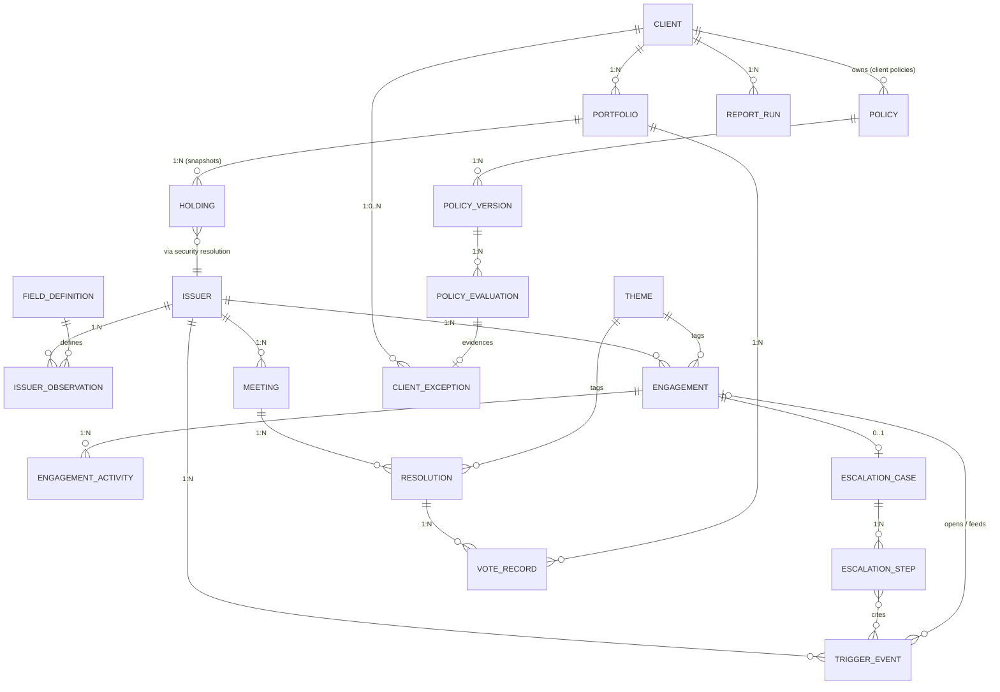
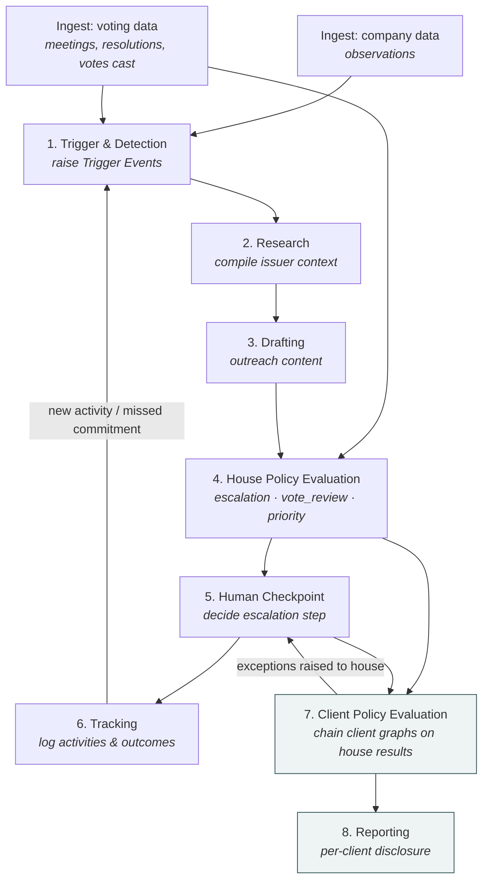

# Stewardship Automation — Data Model, Process Graph, and Process Activities

One data model, one process graph, and eight stages of activity. House truth is
written once per issuer, engagement or resolution. The client overlay only enters
at stages 7–8, and it stores only what differs from house truth.

**Status: target design, not yet implemented.**

## Design constraints

These are fixed inputs to the design. They are not open questions.

1. **Voting is consumed, never executed.** Meetings, resolutions, house
   recommendations and the votes cast all arrive *after the fact* from an external
   source. The tool never drafts, instructs or casts a vote. It reviews votes that
   have already been cast against policy, and it uses vote outcomes as engagement
   triggers.
2. **Escalation has many triggers.** A vote outcome is one of them. Controversies,
   score movements, missed commitments, stalled dialogue, calendar dates and manual
   input are others. The central (house) policy defines escalation logic, and so
   does every client policy.
3. **Company data is large and open-ended.** The model does not hardcode company
   attributes. CLTI, nature and any other score are placeholders: rows in a field
   catalogue, not columns.
4. **One rule engine.** House rules and client rules are both GoRules JSON Decision
   Model (JDM) graphs. They run on the ZEN engine and are edited in the existing
   rule-graph editor. There is no second rule language and no Python-only policy.

---

## Part 1 — The Data Model

Four layers:

- **Reference & company data** — who the issuers are and everything known about them.
- **House truth** — engagements, escalations and ingested voting facts, written once.
- **Policy** — versioned rule graphs, owned by the house or by a client, plus an
  audit row for every evaluation.
- **Client overlay** — clients, their portfolios, and *exceptions only*: rows where
  a client policy's result differs from the house result.

### Reference & company data

#### Issuer
A thin identity row. Everything descriptive or measured lives in observations.

| Field | Type | Notes |
|---|---|---|
| issuer_id | PK, string | The join key everywhere. Holdings reach it through the security→issuer resolution. |
| name, country, region, sector | string | Stable reference attributes only. `region` is derived from `country` by a mapping table. |

#### Field Definition
The catalogue of everything that can be known about an issuer. **New scores and
data sets are added here as rows, never as schema changes.**

| Field | Type | Notes |
|---|---|---|
| field_id | PK, string | Dotted, stable names, e.g. `score.clti`, `score.nature`, `governance.board_independence_pct`. This is the name rule graphs use. |
| label, category | string | `category` groups fields in the editor (score, governance, climate, controversy, …). |
| value_type, unit | enum, string | number \| text \| bool \| date. |
| source | string | Provider or pipeline that populates it. |

#### Issuer Observation
One value of one field for one issuer at one point in time. **Append-only**: a
correction is a new row with a later `observed_at`, so any past evaluation can be
reproduced from what was known then.

| Field | Type | Notes |
|---|---|---|
| issuer_id + field_id + period + observed_at | composite PK | |
| value | number \| text \| bool | Exactly one value; typed by the field definition. |
| source, confidence | string, decimal | |

The rule engine does not query this table directly. Evaluations use the **issuer
context**: the latest observation per field as of a given date, flattened into
`{"score": {"clti": 61.2, "nature": 44}, "governance": {...}}`. It is a derived
read, never stored as its own entity. At scale it becomes a materialised "latest
value" view.

#### Theme
A controlled vocabulary (e.g. `climate_transition`, `board_governance`,
`executive_compensation`). Engagements and resolutions both carry a `theme_id`.
Priority weights and the engagement↔vote link only work if both sides use the same
list, and free-text themes break both.

### House truth — client-agnostic, written once

#### Engagement

| Field | Type | Notes |
|---|---|---|
| engagement_id | PK, string | One per issuer × theme dialogue. |
| issuer_id | FK → Issuer | 1 : N. |
| theme_id | FK → Theme | |
| status, milestone | enum | open \| stalled \| resolved \| closed; milestone ladder is configuration. |
| opened_by_trigger_id | FK → Trigger Event | Why it exists. |

#### Engagement Activity
Append-only log of outreach, meetings, responses and commitments. It replaces the
`outreach_history` array, so each item can be queried, dated and attributed.

| Field | Type | Notes |
|---|---|---|
| activity_id | PK | |
| engagement_id | FK → Engagement | |
| type | enum | letter \| call \| meeting \| response \| commitment \| commitment_verified \| commitment_missed |
| occurred_at, summary, doc_ref, logged_by | | |
| target_date | date, nullable | For commitments; a missed date raises a trigger. |

#### Trigger Event
Every reason something might need attention, in one table. **This is where
escalation's many triggers converge**, and where voting feeds engagement.

| Field | Type | Notes |
|---|---|---|
| trigger_id | PK | |
| issuer_id | FK → Issuer | |
| type | enum | vote_outcome \| controversy \| score_change \| commitment_missed \| engagement_stalled \| calendar \| manual |
| theme_id | FK → Theme, nullable | |
| engagement_id | FK, nullable | Set when the trigger is matched to an open engagement. |
| subject_ref | string, nullable | What it points at, e.g. a `resolution_id` for vote outcomes or a `field_id` for score changes. |
| payload | JSON | Type-specific facts (support %, old/new score, controversy severity, …). |
| detected_at, source | | |

#### Escalation Case / Escalation Step
An escalation belongs to an **engagement**. A vote is one possible *trigger* for a
step and one possible *lever* (e.g. "vote against the chair"), but it is not what
the case hangs off.

| Escalation Case | Type | Notes |
|---|---|---|
| escalation_id | PK | |
| engagement_id | FK → Engagement, unique | 0..1 per engagement. |
| current_step | int | Position on the ladder; ladder labels are configuration. |

| Escalation Step | Type | Notes |
|---|---|---|
| escalation_id + seq | composite PK | Append-only history. |
| step | int | |
| trigger_ids | array → Trigger Event | What prompted it. |
| recommended_by_evaluation_id | FK → Policy Evaluation | The house policy's recommendation. |
| decided_by, decided_at, note | | **Human checkpoint.** A step exists only once a person decides it. |

#### Meeting / Resolution / Vote Record — ingested, read-only
All three are loaded from the external voting source after the event. Nothing in
the tool writes them except the ingestion job.

| Meeting | Type | Notes |
|---|---|---|
| meeting_id | PK | **Natural key**: `issuer_id + meeting_date + meeting_type`. Re-ingesting the same file gives the same IDs. |
| issuer_id, meeting_date, meeting_type | | AGM \| EGM. |

| Resolution | Type | Notes |
|---|---|---|
| resolution_id | PK | Natural key: `meeting_id + item_number`. |
| item_number, text, category, proponent | | category: director election, say-on-pay, auditor, shareholder proposal, … |
| theme_id | FK → Theme | Assigned at ingestion (mapping table from category, then manual correction). |
| management_recommendation | enum | |
| house_recommendation, house_rationale | enum, string | As supplied by the source. |
| outcome, support_pct | enum, decimal | Meeting result, once known. |

| Vote Record | Type | Notes |
|---|---|---|
| resolution_id + portfolio_id | composite PK | The grain is **portfolio × resolution**, because split and pass-through votes differ per portfolio. |
| vote_cast | enum | for \| against \| abstain \| withhold \| not_voted |
| voted_by | enum | house \| client (pass-through) |
| rationale | string, nullable | |
| source_batch_id | string | Which ingestion file it came from. |

### Policy — one engine, house and clients alike

#### Policy / Policy Version

| Policy | Type | Notes |
|---|---|---|
| policy_id | PK | |
| owner | enum + FK | `house`, or `client` + client_id. |
| domain | enum | escalation \| vote_review \| priority (extensible). |
| active_version | int | |

| Policy Version | Type | Notes |
|---|---|---|
| policy_id + version | composite PK | **Immutable** once saved; an edit is a new version. |
| graph | JSON | A JDM graph, evaluated by ZEN, edited in the rule-graph editor. |
| effective_from, approved_by, approved_at | | Nothing evaluates against an unapproved version. |

**Every domain has a fixed input/output contract**, so any graph for that domain
(house or client) is interchangeable:

| Domain | Evaluated per | Input context | Output |
|---|---|---|---|
| escalation | engagement, whenever a trigger lands on it | `issuer` (context), `engagement`, `escalation` (current step, history length), `trigger` | `recommended_step`, `reason` |
| vote_review | vote record | `issuer`, `resolution`, `vote` (incl. `voted_by`), `engagement` (open, same theme, current step), `portfolio` | `expected_vote`, `consistent` (bool), `reason` |
| priority | engagement | `issuer`, `engagement`, `holding` (client's aggregate weight in the issuer) | `relevance` (number), `include` (bool) |

**House → client chaining.** A client graph is evaluated with the house result in
its input under `house.*`. A client that agrees with the house simply returns
`house.*`; a client with a stricter rule overrides one field. That is how "voting
policy deltas" and "priority weights" are expressed: as small graphs that start
from the house answer. They are not a separate delta format. A client with no
policy for a domain inherits the house result.

#### Policy Evaluation
The audit trail. It makes every recommendation, exception and report number
traceable to a rule version and its inputs.

| Field | Type | Notes |
|---|---|---|
| evaluation_id | PK | |
| policy_id + version | FK → Policy Version | |
| subject_type, subject_id | enum, string | engagement \| vote_record. |
| as_of | date | Observation cut-off used for the issuer context. |
| input_hash, output | string, JSON | The full input can be rebuilt from `as_of`, so only its hash is stored. |
| evaluated_at | timestamp | |

### Client overlay — thin, per client

#### Client

| Field | Type | Notes |
|---|---|---|
| client_id | PK | |
| name | string | |
| reporting_template_ref | FK → report template | Existing Report Builder templates. |

The old *Client Policy Profile* is not an entity any more. It is simply the set of
`POLICY` rows the client owns, plus this template reference.

#### Portfolio / Holding

| Portfolio | Type | Notes |
|---|---|---|
| portfolio_id | PK | |
| client_id | FK → Client | 1 : N. |
| vehicle_type | enum | SMA \| CCF \| ETF |
| voting_mode | enum | house_voted \| pass_through. Part of the vote_review input, so a client policy can treat its own pass-through votes differently. |

Holdings keep the existing shape: immutable snapshots keyed by
`portfolio_id + security_id + as_of_date`, with the issuer reached through the
security→issuer resolution. Sector is read from the Issuer, not copied onto each row.

#### Client Exception
The whole stored overlay. **A row exists only where a client policy's output
differs from the house output**, so most clients have zero rows for most subjects,
and adding a client never touches house data.

| Field | Type | Notes |
|---|---|---|
| client_id + domain + subject_id | composite PK | subject = engagement_id or resolution_id + portfolio_id. |
| evaluation_id | FK → Policy Evaluation | The client evaluation that produced it. |
| house_evaluation_id | FK → Policy Evaluation | What it deviates from. |
| kind | enum | escalation_differs \| vote_inconsistent \| priority_differs |
| detail | JSON | e.g. `{"house_step": 2, "client_step": 4}`. |
| status | enum | open \| acknowledged \| raised_to_house |

Priority relevance is **not stored** per client × engagement. It is evaluated at
read time. It is persisted only as an exception, when the client's `include`
disagrees with the house.

A client's escalation result cannot run its own engagement, because the house
engages each company once. A higher client step therefore becomes an exception
that is (a) shown at the house human checkpoint and (b) reported to the client.

#### Report Run
Reports are rendered from data at generation time and are not stored content. Only
the facts needed to reproduce and audit them are kept.

| Field | Type | Notes |
|---|---|---|
| report_id | PK | |
| client_id | FK → Client | |
| period_start, period_end | date | Filters activities, steps, votes and triggers by date. |
| as_of | date | Observation cut-off. |
| policy_versions | array | Exact versions used, so the report can be regenerated identically. |
| status | enum | draft \| approved \| sent. |
| approved_by, approved_at | | **Human checkpoint**: compliance/legal. |
| delivery_log | array | recipient, channel, sent_at. |

---

## Part 2 — The Process Graph

Two inputs feed the house layer: the engagement track and ingested voting data.
Trigger Events join them. Stages 1–6 use house policies only; stages 7–8 add client
policies.

---

## Part 3 — Process Activities

### 1. Trigger & Detection
- Turn new inputs into Trigger Events: a vote outcome (e.g. low support, a house
  vote against management), a controversy, an observation crossing a threshold, a
  missed commitment date, a stalled engagement, a calendar date, or manual input.
- Match each trigger to an open engagement on the same issuer + theme, or open a
  new engagement.

**Reads:** Issuer, Issuer Observation, Resolution, Vote Record, Engagement Activity
**Writes:** Trigger Event, Engagement (create)
**Human checkpoint:** —

### 2. Research
- Build the issuer context (latest observations as of today) and compile history:
  prior engagements, activities, triggers, and past votes on the same theme.

**Reads:** Issuer, Issuer Observation, Engagement, Engagement Activity, Trigger Event, Resolution, Vote Record
**Writes:** Engagement Activity (research note)
**Human checkpoint:** —

### 3. Drafting
- Prepare outreach content for the engagement. There is no vote drafting, because
  votes are consumed only.

**Reads:** Engagement, Engagement Activity, issuer context
**Writes:** Engagement Activity (draft)
**Human checkpoint:** before any outreach is sent (a draft only becomes a `letter`
activity once a person has sent it).

### 4. House Policy Evaluation
- **escalation** — for each engagement with new triggers → recommended step.
- **vote_review** — for each newly ingested vote record → consistent with house
  policy and with open engagements, or not.
- **priority** — house relevance per engagement.

**Reads:** Policy Version (house), issuer context, Engagement, Escalation Case, Trigger Event, Resolution, Vote Record
**Writes:** Policy Evaluation
**Human checkpoint:** —

### 5. Human Checkpoint
- Review escalation recommendations (and client exceptions raised to house) and
  decide the step.
- Review inconsistent house votes and record an explanation. The vote itself is
  already cast and is not changed here.

**Reads:** Policy Evaluation, Escalation Case, Client Exception (raised_to_house)
**Writes:** Escalation Step, Engagement Activity (vote-inconsistency note)
**Human checkpoint:** this stage.

### 6. Tracking
- Log activities, commitments and their outcomes; update engagement status and
  milestone. Missed dates and stalls go back to stage 1 as triggers.

**Reads:** Engagement, Engagement Activity
**Writes:** Engagement (status, milestone), Engagement Activity
**Human checkpoint:** commitments are logged only once a person has validated them.

### 7. Client Policy Evaluation *(client overlay)*
- For each client and domain, evaluate the client's graph with the house result
  under `house.*`.
- Write a Client Exception wherever the output differs. For vote_review, evaluate
  only the vote records of that client's portfolios.

**Reads:** Policy Version (client), Policy Evaluation (house), issuer context, Portfolio, Holding, Vote Record
**Writes:** Policy Evaluation (client), Client Exception
**Human checkpoint:** —

### 8. Reporting *(client overlay)*
- For the period: the client's holdings, the engagements they include (priority),
  escalation steps, votes cast in their portfolios with house/client consistency,
  and their exceptions, all rendered through the client's template.

**Reads:** everything above, filtered by client, period and as_of
**Writes:** Report Run, delivery_log
**Human checkpoint:** compliance/legal approval before the report is sent.

---

**The pattern to notice:** stages 1–6 never read a client policy or write a client
row. Onboarding a client means adding a Client, its Portfolios and, optionally,
its Policy graphs. With no graphs, the client inherits every house result and
generates zero exceptions.

---

## Part 4 — Building on the existing code

| Need | Reuse |
|---|---|
| Rule evaluation | `arp/decision/rules.py::evaluate_rows` (ZEN 2.0.2, batch evaluation). The same engine build runs in the browser for live preview. |
| Rule editing | `frontend/src/components/RuleGraphEditor.tsx` + `lib/zenEngine.ts`. |
| Immutable versions + approval | `arp/storage/decision_store.py` pattern (`new_version`, `ratify`, per-version audit). |
| Append-only observations | `DataPointObservation` + `PortfolioStore.latest_observation(as_of=...)` in `arp/schemas/portfolio.py`: already the Issuer Observation shape. |
| Holdings, security→issuer | `Holding`, `SecurityResolution`, `PortfolioStore` snapshots. |
| Report templates | `arp/storage/reporting_store.py` (Report Builder). |
| Postgres at volume | existing projection pattern in `arp/storage/postgres_*_projection.py`. |

**Storage split.** Small, versioned configuration (policies, clients, themes, field
catalogue) goes in JSON file stores, like `DecisionStore`. High-volume facts
(observations, vote records, trigger events, evaluations) go in Postgres, which the
issuer context and report queries read.

## Open points

1. Source format of the voting feed (provider export / CSV layout), which fixes
   the ingestion mapping and the natural keys.
2. Escalation ladder labels and the milestone ladder: configuration values, to be
   supplied by the house.
3. Theme list: whether to seed it from the existing taxonomy library or start with
   a short hand-maintained list.
