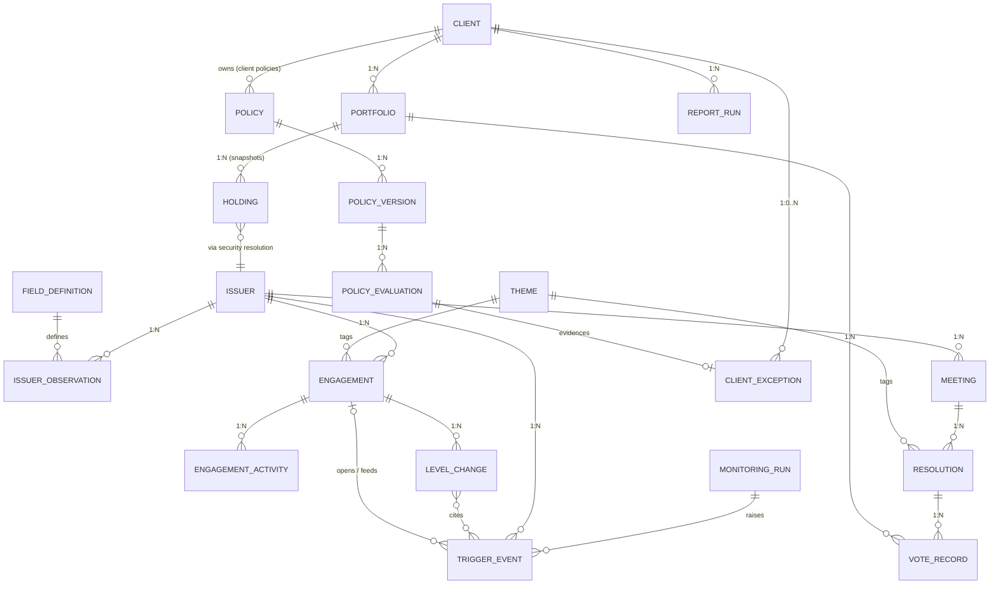
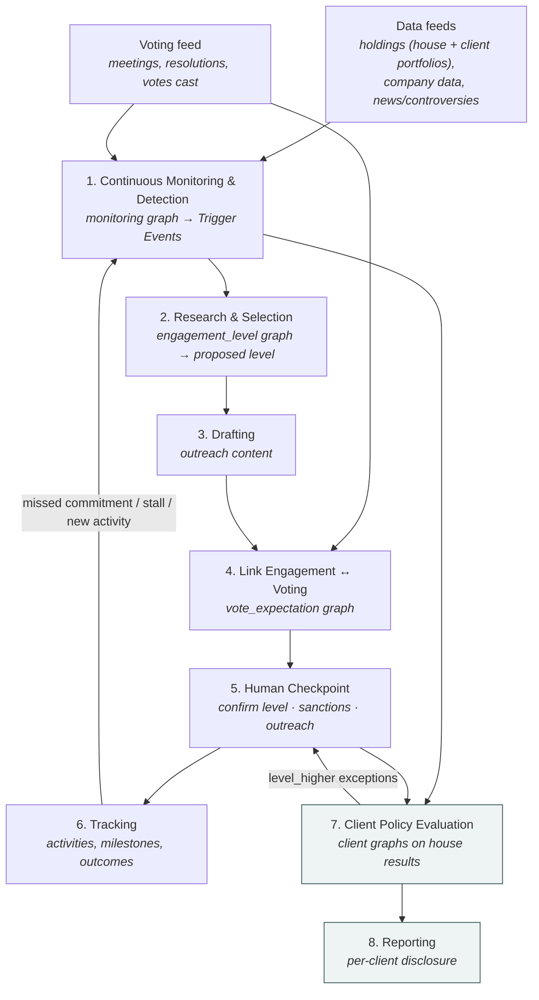
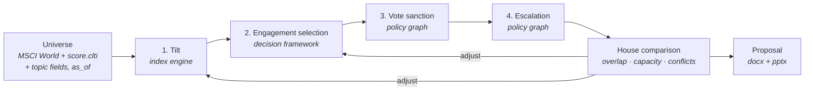

# Stewardship Automation — Data Model, Process Graph, and Process Activities

One data model, one process graph, and eight stages of activity. House truth is
written once per issuer, engagement or resolution. The client overlay only enters
at stages 7–8, and it stores only what differs from house truth.

**Status: target design, not yet implemented.**

## Design constraints

These are fixed inputs to the design. They are not open questions.

1. **Voting is consumed, never executed.** Meetings, resolutions, house
   recommendations and the votes cast all arrive *after the fact* from an external
   source. The tool never drafts, instructs or casts a vote. It reviews votes that
   have already been cast against policy, and it uses vote outcomes as engagement
   triggers.
2. **Escalation has many triggers.** A vote outcome is one of them. Controversies,
   score movements, missed commitments, stalled dialogue, calendar dates and manual
   input are others. The central (house) policy defines escalation logic, and so
   does every client policy.
3. **Company data is large and open-ended.** The model does not hardcode company
   attributes. CLTI, nature and any other score are placeholders: rows in a field
   catalogue, not columns.
4. **One rule engine.** House rules and client rules are both GoRules JSON Decision
   Model (JDM) graphs. They run on the ZEN engine and are edited in the existing
   rule-graph editor. There is no second rule language and no Python-only policy.

---

## Part 1 — The Data Model

Four layers:

- **Reference & company data** — who the issuers are and everything known about them.
- **House truth** — engagements with their engagement level, and ingested voting facts, written once.
- **Policy** — versioned rule graphs, owned by the house or by a client, plus an
  audit row for every evaluation.
- **Client overlay** — clients, their portfolios, and *exceptions only*: rows where
  a client policy's result differs from the house result.

### Reference & company data

#### Issuer
A thin identity row. Everything descriptive or measured lives in observations.

| Field | Type | Notes |
|---|---|---|
| issuer_id | PK, string | The join key everywhere. Holdings reach it through the security→issuer resolution. |
| name, country, region, sector | string | Stable reference attributes only. `region` is derived from `country` by a mapping table. |

#### Field Definition
The catalogue of everything that can be known about an issuer. **New scores and
data sets are added here as rows, never as schema changes.**

| Field | Type | Notes |
|---|---|---|
| field_id | PK, string | Dotted, stable names, e.g. `score.clti`, `score.nature`, `governance.board_independence_pct`. This is the name rule graphs use. |
| label, category | string | `category` groups fields in the editor (score, governance, climate, controversy, …). |
| value_type, unit | enum, string | number \| text \| bool \| date. |
| source | string | Provider or pipeline that populates it. |

#### Issuer Observation
One value of one field for one issuer at one point in time. **Append-only**: a
correction is a new row with a later `observed_at`, so any past evaluation can be
reproduced from what was known then.

| Field | Type | Notes |
|---|---|---|
| issuer_id + field_id + period + observed_at | composite PK | |
| value | number \| text \| bool | Exactly one value; typed by the field definition. |
| source, confidence | string, decimal | |

The rule engine does not query this table directly. Evaluations use the **issuer
context**: the latest observation per field as of a given date, flattened into
`{"score": {"clti": 61.2, "nature": 44}, "governance": {...}}`. It is a derived
read, never stored as its own entity. At scale it becomes a materialised "latest
value" view.

#### Theme
A controlled vocabulary (e.g. `climate_transition`, `board_governance`,
`executive_compensation`). Engagements and resolutions both carry a `theme_id`.
Priority weights and the engagement↔vote link only work if both sides use the same
list, and free-text themes break both.

### House truth — client-agnostic, written once

#### Monitoring scope and Monitoring Run
Stage 1 continuously monitors **every issuer in scope**:

- the **house scope**: every issuer held in any in-scope portfolio, as of the
  monitoring date; and
- every **client portfolio**, including issuers only that client holds.

Scope is derived from the holdings snapshots at run time, not stored as its own
list: an issuer enters or leaves scope when it is bought or sold. Each scheduled
pass is recorded so every trigger can be traced back to the data it saw.

| Field | Type | Notes |
|---|---|---|
| run_id | PK | |
| as_of | date | Holdings snapshot date and observation cut-off. |
| portfolios | array → Portfolio | What was in scope for this run. |
| issuer_count, trigger_count | int | |
| policy_version | FK → Policy Version | The house `monitoring` graph used. |

Reading holdings is not a client *policy*: the monitoring run treats client
portfolios as data, so stages 1–6 still never read a client policy.

#### Engagement levels
One ladder describes **how intensively the house engages an issuer on a theme**.
Selection and escalation both move an engagement along it,
so they share one ladder, one policy domain and one history table. Stage 2
proposes a level; stage 5 is where a person confirms it.

| Level | Name | Meaning | Typical ladder steps |
|---|---|---|---|
| 0 | Monitor | In scope and watched through data only. No engagement row exists. | — |
| 1 | Watchlist | Flagged by monitoring or selection. Engagement opened; desk research, no outreach yet. | — |
| 2 | Engage | Active dialogue, private or collaborative (`mode`). | private engagement, joint engagement |
| 3 | Engage + vote sanction | Dialogue continues, and the policy expects a vote against management at the next AGM (e.g. against the chair or say-on-pay). | vote against management |
| 4 | Escalate | Formal escalation beyond voting. | written escalation to the board, escalation to the chair, co-file a resolution, public statement |

Level names, the number of levels and the steps within each level are
configuration. The table is the proposed default. Within a level, `step` records
the exact rung (e.g. level 4 step "co-file a resolution").

#### Engagement

| Field | Type | Notes |
|---|---|---|
| engagement_id | PK, string | One per issuer × theme dialogue. |
| issuer_id | FK → Issuer | 1 : N. |
| theme_id | FK → Theme | |
| level, step, mode | int, string, enum | Current engagement level (1–4), the rung within it, and private \| collaborative. Written only through Level Change. |
| status, milestone | enum | open \| stalled \| resolved \| closed; the milestone ladder (progress of the dialogue itself) is configuration. |
| opened_by_trigger_id | FK → Trigger Event | Why it exists. |

#### Engagement Activity
Append-only log of outreach, meetings, responses and commitments. It replaces the
`outreach_history` array, so each item can be queried, dated and attributed.

| Field | Type | Notes |
|---|---|---|
| activity_id | PK | |
| engagement_id | FK → Engagement | |
| type | enum | letter \| call \| meeting \| response \| commitment \| commitment_verified \| commitment_missed |
| occurred_at, summary, doc_ref, logged_by | | |
| target_date | date, nullable | For commitments; a missed date raises a trigger. |

#### Trigger Event
Every reason something might need attention, in one table. **This is where
escalation's many triggers converge**, and where voting feeds engagement.

| Field | Type | Notes |
|---|---|---|
| trigger_id | PK | |
| issuer_id | FK → Issuer | |
| type | enum | vote_outcome \| controversy \| score_change \| holding_change \| commitment_missed \| engagement_stalled \| calendar \| manual |
| theme_id | FK → Theme, nullable | |
| engagement_id | FK, nullable | Set when the trigger is matched to an open engagement. |
| subject_ref | string, nullable | What it points at, e.g. a `resolution_id` for vote outcomes or a `field_id` for score changes. |
| payload | JSON | Type-specific facts (support %, old/new score, controversy severity, …). |
| run_id | FK → Monitoring Run, nullable | Set when raised by a monitoring pass. |
| detected_at, source | | |

#### Level Change
Append-only history of every move on the engagement ladder: selection onto the
ladder, escalation up it, and de-escalation or closure down it. A vote is one
possible *trigger* for a change and level 3 is where a vote becomes the *lever*,
but the change always belongs to the engagement, never to a resolution.

| Field | Type | Notes |
|---|---|---|
| engagement_id + seq | composite PK | |
| from_level, to_level, step | int, int, string | |
| trigger_ids | array → Trigger Event | What prompted it. |
| recommended_by_evaluation_id | FK → Policy Evaluation | The house `engagement_level` recommendation. |
| decided_by, decided_at, note | | **Human checkpoint.** A change exists only once a person decides it. |

#### Meeting / Resolution / Vote Record — ingested, read-only
All three are loaded from the external voting source after the event. Nothing in
the tool writes them except the ingestion job.

| Meeting | Type | Notes |
|---|---|---|
| meeting_id | PK | **Natural key**: `issuer_id + meeting_date + meeting_type`. Re-ingesting the same file gives the same IDs. |
| issuer_id, meeting_date, meeting_type | | AGM \| EGM. |

| Resolution | Type | Notes |
|---|---|---|
| resolution_id | PK | Natural key: `meeting_id + item_number`. |
| item_number, text, category, proponent | | category: director election, say-on-pay, auditor, shareholder proposal, … |
| theme_id | FK → Theme | Assigned at ingestion (mapping table from category, then manual correction). |
| management_recommendation | enum | |
| house_recommendation, house_rationale | enum, string | As supplied by the source. |
| outcome, support_pct | enum, decimal | Meeting result, once known. |

| Vote Record | Type | Notes |
|---|---|---|
| resolution_id + portfolio_id | composite PK | The grain is **portfolio × resolution**, because split and pass-through votes differ per portfolio. |
| vote_cast | enum | for \| against \| abstain \| withhold \| not_voted |
| voted_by | enum | house \| client (pass-through) |
| rationale | string, nullable | |
| source_batch_id | string | Which ingestion file it came from. |

### Policy — one engine, house and clients alike

#### Policy / Policy Version

| Policy | Type | Notes |
|---|---|---|
| policy_id | PK | |
| owner | enum + FK | `house`, or `client` + client_id. |
| domain | enum | monitoring \| engagement_level \| vote_expectation (extensible). |
| active_version | int | |

| Policy Version | Type | Notes |
|---|---|---|
| policy_id + version | composite PK | **Immutable** once saved; an edit is a new version. |
| graph | JSON | A JDM graph, evaluated by ZEN, edited in the rule-graph editor. |
| effective_from, approved_by, approved_at | | Nothing evaluates against an unapproved version. |

**Every domain has a fixed input/output contract**, so any graph for that domain
(house or client) is interchangeable:

| Domain | Evaluated per | Input context | Output |
|---|---|---|---|
| monitoring | issuer in scope, each monitoring run | `issuer` (context, incl. change since the last run), `holding` (weight, change in weight, which portfolios hold it) | `triggers`: list of {type, theme, severity, detail} |
| engagement_level | issuer × theme: every candidate from stage 1, and every open engagement with new triggers | `issuer`, `holding`, `engagement` (null if none: current level, step, milestone, months at level, commitments), `triggers` since the last decision, `selection` (score, tier and leverage from the decision framework, if one is attached) | `level`, `step`, `mode`, `relevance`, `reason` |
| vote_expectation | resolution (before the meeting) and vote record (once ingested) | `issuer`, `resolution`, `engagement` (level, step, theme), `portfolio`, `vote` (null before the meeting) | `expected_vote`, `consistent` (null before the meeting), `reason` |

`engagement_level` covers both selection and escalation: for an issuer with no
engagement it answers "should we start, and at which level?", and for an open
engagement it answers "stay, move up, or move down?". `vote_expectation` evaluated
before a meeting gives the vote-sanction list for level 3 engagements; evaluated
after ingestion, it checks the vote that was actually cast.

**House → client chaining.** A client graph is evaluated with the house result in
its input under `house.*`. A client that agrees with the house simply returns
`house.*`; a client with a stricter rule overrides one field. That is how a client's
voting deviations, selection preferences and escalation rules are expressed: as small graphs that start
from the house answer. They are not a separate delta format. A client with no
policy for a domain inherits the house result.

#### Policy Evaluation
The audit trail. It makes every recommendation, exception and report number
traceable to a rule version and its inputs.

| Field | Type | Notes |
|---|---|---|
| evaluation_id | PK | |
| policy_id + version | FK → Policy Version | |
| subject_type, subject_id | enum, string | issuer \| issuer_theme \| engagement \| resolution \| vote_record. |
| as_of | date | Observation cut-off used for the issuer context. |
| input_hash, output | string, JSON | The full input can be rebuilt from `as_of`, so only its hash is stored. |
| evaluated_at | timestamp | |

### Client overlay — thin, per client

#### Client

| Field | Type | Notes |
|---|---|---|
| client_id | PK | |
| name | string | |
| reporting_template_ref | FK → report template | Existing Report Builder templates. |

The old *Client Policy Profile* is not an entity any more. It is simply the set of
`POLICY` rows the client owns, plus this template reference.

#### Portfolio / Holding

| Portfolio | Type | Notes |
|---|---|---|
| portfolio_id | PK | |
| client_id | FK → Client | 1 : N. |
| vehicle_type | enum | SMA \| CCF \| ETF |
| voting_mode | enum | house_voted \| pass_through. Part of the vote_expectation input, so a client policy can treat its own pass-through votes differently. |

Holdings keep the existing shape: immutable snapshots keyed by
`portfolio_id + security_id + as_of_date`, with the issuer reached through the
security→issuer resolution. Sector is read from the Issuer, not copied onto each row.

#### Client Exception
The whole stored overlay. **A row exists only where a client policy's output
differs from the house output**, so most clients have zero rows for most subjects,
and adding a client never touches house data.

| Field | Type | Notes |
|---|---|---|
| client_id + domain + subject_id | composite PK | subject = issuer_id + theme_id, engagement_id, or resolution_id + portfolio_id. |
| evaluation_id | FK → Policy Evaluation | The client evaluation that produced it. |
| house_evaluation_id | FK → Policy Evaluation | What it deviates from. |
| kind | enum | level_higher \| level_lower \| vote_expectation_differs \| vote_inconsistent |
| detail | JSON | e.g. `{"house_level": 1, "client_level": 3}`. |
| status | enum | open \| acknowledged \| raised_to_house |

Client relevance is **not stored** per client × engagement. It is evaluated at
read time and persisted only when the client's level differs from the house level.

The house engages each company once, so a client cannot run its own dialogue. A
client level higher than the house level (including an issuer only that client
holds, where the house level is 0) becomes a `level_higher` exception that is
(a) shown at the house human checkpoint, where the house can adopt it, and
(b) reported to the client either way. A vote expectation that differs from the
house only affects that client's portfolios, and is deliverable only where the
client's shares can be voted separately (Part 5.3).

#### Report Run
Reports are rendered from data at generation time and are not stored content. Only
the facts needed to reproduce and audit them are kept.

| Field | Type | Notes |
|---|---|---|
| report_id | PK | |
| client_id | FK → Client | |
| period_start, period_end | date | Filters activities, steps, votes and triggers by date. |
| as_of | date | Observation cut-off. |
| policy_versions | array | Exact versions used, so the report can be regenerated identically. |
| status | enum | draft \| approved \| sent. |
| approved_by, approved_at | | **Human checkpoint**: compliance/legal. |
| delivery_log | array | recipient, channel, sent_at. |

---

## Part 2 — The Process Graph

Stage 1 runs continuously over everything in scope. Stages 2–6 act on the issuers
it surfaces, using house policies only. Stages 7–8 add client policies.

---

## Part 3 — Process Activities

### 1. Continuous Monitoring & Detection
Runs on a schedule (daily for news and controversies, on each holdings or data
refresh otherwise) over the full monitoring scope.

- Take the latest holdings snapshot of **all in-scope house portfolios and every
  client portfolio**; the union of their issuers is the scope for this run.
- Refresh the issuer context for each issuer: holdings and weight changes, scores,
  controversies and any other observed field.
- Evaluate the house `monitoring` graph per issuer and write a Trigger Event for
  each output: a score crossing a threshold, a new or worsening controversy, a
  large holding change, a vote outcome from the voting feed, a missed commitment,
  a stalled engagement, a calendar date.
- Attach each trigger to an open engagement on the same issuer + theme where one
  exists. Triggers on issuers with no engagement make them selection candidates.

**Reads:** Portfolio, Holding (house and client portfolios), Issuer, Issuer Observation, Resolution, Vote Record, Engagement, Engagement Activity
**Writes:** Monitoring Run, Trigger Event
**Human checkpoint:** —

### 2. Research & Selection
- **Selection.** For each candidate (issuer × theme with new triggers) and each open
  engagement with new triggers, evaluate the house `engagement_level` graph. Inputs
  include the triggers, the issuer context and, where a decision framework is
  attached, its score, tier and leverage (position size × gap to a perfect score).
  The output is a proposed level (0–4), step and relevance.
- Candidates proposed at level 1 or higher get an Engagement row at level 0
  (pending) until the checkpoint confirms the level.
- **Research.** For every proposed level ≥ 1, compile the dossier: company context,
  prior engagements and their outcomes, triggers, and past votes on the same theme.

**Reads:** Policy Version (house `engagement_level`), issuer context, Trigger Event, Engagement, Engagement Activity, Resolution, Vote Record, decision framework results
**Writes:** Policy Evaluation, Engagement (create, pending), Engagement Activity (research note)
**Human checkpoint:** —

### 3. Drafting
- Prepare outreach content for the engagement. There is no vote drafting, because
  votes are consumed only.

**Reads:** Engagement, Engagement Activity, issuer context
**Writes:** Engagement Activity (draft)
**Human checkpoint:** before any outreach is sent (a draft only becomes a `letter`
activity once a person has sent it).

### 4. Link Engagement ↔ Voting
- For upcoming meetings, evaluate `vote_expectation` per resolution. For issuers at
  level 3 this produces the **vote-sanction list** (e.g. vote against the chair),
  which is published to whoever votes. The tool never casts the vote.
- For newly ingested vote records, evaluate `vote_expectation` again and record
  whether the vote cast was consistent. An inconsistent vote on a level 3
  engagement, or a failed or low-support vote, becomes a Trigger Event.

**Reads:** Policy Version (house `vote_expectation`), Engagement (level, theme), Resolution, Vote Record, Portfolio
**Writes:** Policy Evaluation, Trigger Event
**Human checkpoint:** —

### 5. Human Checkpoint
- Confirm or change each proposed level from stage 2: selection onto the ladder,
  escalation up it, de-escalation or closure down it. Also review `level_higher`
  exceptions raised by clients.
- Approve the vote-sanction list before it is published.
- Authorise outreach before anything is sent.
- For votes cast inconsistently with house policy, record an explanation. The vote
  itself already happened and is not changed.

**Reads:** Policy Evaluation, Engagement, Client Exception (raised_to_house), drafts
**Writes:** Level Change, Engagement (level, step, mode), Engagement Activity
**Human checkpoint:** this stage.

### 6. Tracking
- Log activities, commitments and their outcomes; update engagement status and
  milestone. Missed dates and stalls go back to stage 1 as triggers.

**Reads:** Engagement, Engagement Activity
**Writes:** Engagement (status, milestone), Engagement Activity
**Human checkpoint:** commitments are logged only once a person has validated them.

### 7. Client Policy Evaluation *(client overlay)*
- For each client, evaluate the client's `engagement_level` graph over **the
  client's own portfolio** (every issuer they hold, including ones outside the house
  scope), with the house result under `house.*`. For issuers the house does not
  engage, the house result is level 0.
- Evaluate the client's `vote_expectation` graph for resolutions and vote records of
  the client's portfolios.
- Write a Client Exception wherever the output differs from the house. Raise
  `level_higher` exceptions to the house checkpoint (stage 5).

**Reads:** Policy Version (client), Policy Evaluation (house), issuer context, Portfolio, Holding, Vote Record
**Writes:** Policy Evaluation (client), Client Exception
**Human checkpoint:** —

### 8. Reporting *(client overlay)*
- For the period: the client's holdings, the engagements relevant to them with
  their levels and level changes, votes cast in their portfolios with house/client consistency,
  and their exceptions, all rendered through the client's template.

**Reads:** everything above, filtered by client, period and as_of
**Writes:** Report Run, delivery_log
**Human checkpoint:** compliance/legal approval before the report is sent.

---

**The pattern to notice:** stages 1–6 never read a client policy or write a client
row. Onboarding a client means adding a Client, its Portfolios and, optionally,
its Policy graphs. With no graphs, the client inherits every house result and
generates zero exceptions.

---

## Part 4 — Building on the existing code

| Need | Reuse |
|---|---|
| Rule evaluation | `arp/decision/rules.py::evaluate_rows` (ZEN 2.0.2, batch evaluation). The same engine build runs in the browser for live preview. |
| Rule editing | `frontend/src/components/RuleGraphEditor.tsx` + `lib/zenEngine.ts`. |
| Immutable versions + approval | `arp/storage/decision_store.py` pattern (`new_version`, `ratify`, per-version audit). |
| Append-only observations | `DataPointObservation` + `PortfolioStore.latest_observation(as_of=...)` in `arp/schemas/portfolio.py`: already the Issuer Observation shape. |
| Holdings, security→issuer | `Holding`, `SecurityResolution`, `PortfolioStore` snapshots. |
| Report templates, docx/pptx output | `arp/storage/reporting_store.py`, `arp/reporting/` (Report Builder). |
| Portfolio tilting | `arp/index/` (`metric_tilt`, constraints, TE budget, versioned calibrations). |
| Target selection by leverage | `arp/decision/` (scoring, `tier_graph`, leverage = size × gap). |
| Alerts and scheduling | `arp/portfolio/monitoring/` (`evaluator.py`, `scheduler.py`). |
| Postgres at volume | existing projection pattern in `arp/storage/postgres_*_projection.py`. |

**Storage split.** Small, versioned configuration (policies, clients, themes, field
catalogue) goes in JSON file stores, like `DecisionStore`. High-volume facts
(observations, vote records, trigger events, evaluations) go in Postgres, which the
issuer context and report queries read.

## Part 5 — Client program design, calibration and monitoring

**Scenario.** The house stewardship program runs. A client wants their own
program on an MSCI World portfolio:

1. **Tilt**: over-weight CLTI leaders and under-weight laggards.
2. **Select**: pick engagement targets from the CLTI assessment plus other topics.
3. **Sanction**: for some targets, set a vote sanction at the next AGM.
4. **Escalate**: for some targets, escalate further.

The tool has to let an analyst calibrate all four steps for this client's portfolio
and objective, and check them against the house program for efficiency and
feasibility. It then produces a documented program proposal and a PPT. Once the
client approves, the same definition drives monitoring.

### 5.1 The program as a versioned bundle

A client program is **a set of references to calibrations that already exist**,
plus the client's objective. It is not new logic.

| Step | Engine that does it | Where it lives |
|---|---|---|
| 1. Tilt | Index engine: `metric_tilt` on `score.clti` (rank_percentile or z-score, `[floor, ceiling]` multipliers), constraints and tracking-error budget | `arp/index/` (versioned calibrations in `index_store.py`) |
| 2. Engagement selection | Decision mechanism scores on CLTI + other topic columns, tiers by `tier_graph` and ranks by **leverage** (position size × gap to a perfect score); the client's `engagement_level` graph turns tier + triggers into a level (0–4) | `arp/decision/` + ZEN graph, Part 1 policy layer |
| 3. Vote sanction | Level 3 targets; the client's `vote_expectation` graph says *which vote the program expects* at the next AGM (e.g. against the chair or the say-on-pay) | ZEN graph, Part 1 policy layer |
| 4. Escalation | Level 4, from the same client `engagement_level` graph (chained on the house one) | ZEN graph, Part 1 policy layer |
| Proposal + PPT | Report Builder: datasets → content plan → `pptx` / `docx` | `arp/reporting/` |
| Monitoring | Portfolio alert rules + scheduler, plus stage 7 client exceptions | `arp/portfolio/monitoring/` |

Votes are still consumed only (design constraint 1). A **vote sanction is an
expectation**. The program publishes the sanction list to whoever votes, and the
tool then checks the ingested votes against it. It never instructs or casts a vote.

New entities (additions to Part 1):

| Entity | Key fields | Notes |
|---|---|---|
| CLIENT_PROGRAM | program_id, client_id, portfolio_id, benchmark (`MSCI World`), objective, status | draft → proposed → approved → live → retired. |
| PROGRAM_VERSION | program_id + version, `index_calibration` (id+version), `decision_framework` (id+version), `policy_versions` {engagement_level, vote_expectation}, `capacity` assumptions, approved_by | **Immutable.** Recalibrating makes a new version, so what was proposed, approved and monitored is always exactly reproducible. |
| PROGRAM_SIMULATION | simulation_id, program_id + version, as_of, outputs (below), house_comparison | One per "Run" click in the calibration loop. Cheap to throw away; the version the client approves points at its simulation. |
| PROGRAM_TARGET | program_id + version, issuer_id, theme_id, role, level, origin | role: overweight \| underweight \| engage; `level` 1–4 from the engagement ladder (3 = vote sanction, 4 = escalation). origin: `house` (already in the house program) \| `client_only`. Frozen at approval; this is the monitored list. |
| PROGRAM_KPI_SNAPSHOT | program_id, as_of, kpis (JSON) | One row per monitoring run; the time series behind the monitoring view. |

### 5.2 Calibration loop

One page, one pipeline, rerun on every change. Each step shows its outputs *and*
the house comparison, so the analyst sees the cost of a setting immediately.

| Step | The analyst sets | The tool shows |
|---|---|---|
| Universe | benchmark, as_of, which topic fields to use | coverage of `score.clti` and each topic field across the benchmark; names with no score (handled by the index engine's `missing` policy) |
| 1. Tilt | normalisation, floor/ceiling, TE budget, sector/country caps | active weights of the leaders and laggards, weighted CLTI uplift vs benchmark, tracking error, turnover vs last version |
| 2. Selection | criteria and weights, tier cut-points or tier graph, max targets | the ranked target list by leverage, why each name is in, tier sensitivity (does the list survive a weight change?) |
| 3. Sanction | graph, e.g. `tier == 1 and no_progress_months >= 12 → against chair` | sanction list per upcoming AGM, and where it contradicts the house recommendation |
| 3–4. Sanction & escalation | the client's `engagement_level` graph, chained on the house result | names where the client's level is above the house level |

### 5.3 House comparison — efficiency and feasibility

This is the reason to calibrate *against* the house program and not in isolation.
Each check is computed from the simulation and shown as a traffic light.

| Check | Computed as | Why it matters |
|---|---|---|
| Engagement overlap | share of client targets already in a house engagement (same issuer + theme) | Overlap costs nothing extra: the client joins an existing dialogue. |
| Marginal workload | client-only targets × effort per engagement (capacity assumption) vs free house capacity | The key feasibility number: can the team actually deliver the program? |
| Theme gap | client targets on themes the house does not cover | Needs new expertise; flag it, do not hide it. |
| Vote conflicts | sanctions where the house recommendation differs | Only deliverable if the client's shares can be voted separately. **Feasible in an SMA; not in a pooled CCF/ETF**, which must vote one way. Checked against `Portfolio.vehicle_type`. |
| Level conflicts | client level > house level on the same issuer × theme | One company, one dialogue: the house has to agree to escalate, or the proposal says it won't. |
| Tilt vs engagement coherence | engagement targets that the tilt has sold down to near zero | Leverage falls with the position; engaging a company the portfolio barely holds is weak. |

### 5.4 Proposal and PPT

Generated from the approved simulation through the Report Builder, so every number
in the document comes from the recorded run.

Sections, identical in the docx and the deck:

1. Client objective and the program in one page.
2. Tilt: method, leaders/laggards, CLTI uplift, tracking error, top active weights.
3. Engagement: target list, selection logic, overlap with the house program.
4. Voting: sanction policy, expected sanctions next season, split-vote feasibility.
5. Escalation: ladder, client-specific triggers, conflicts with the house.
6. Feasibility: workload vs capacity and every red/amber check from 5.3, with the
   mitigation chosen.
7. Monitoring: the KPIs and alert thresholds below, and the reporting cadence.
8. Appendix: rule versions, data as_of, full target list.

Each simulation result becomes a Report Builder `QuantitativeDataset` (tables and
charts), and the proposal is one Report Builder request against the client's
template.

### 5.5 Monitoring once live

The approved PROGRAM_VERSION is what gets monitored. A scheduled run (existing
monitoring scheduler) writes a PROGRAM_KPI_SNAPSHOT and raises alerts through the
existing alert rules:

| KPI | Alert when |
|---|---|
| Weighted CLTI vs benchmark | uplift falls below the proposal's target |
| Tracking error, active weight drift | above budget |
| Target membership | a new name qualifies or a target no longer qualifies (the proposal reruns on fresh data) |
| Engagement progress per target | milestone stalled beyond SLA (raises a Trigger Event) |
| Sanction conformance | an ingested vote on a sanctioned resolution does not match the expected vote (becomes a Client Exception) |
| Escalation status | a client-only escalation is waiting on a house decision |

Recalibration is a new program version with its own simulation and proposal.
Monitoring switches to the new version only when it is approved.

### 5.6 Build order

| Phase | Delivers | Effort (rough) |
|---|---|---|
| A | Program, version and target entities; a simulation that runs tilt → selection → sanction → escalation through the existing engines on MSCI World; house comparison | 4–6 days |
| B | Calibration page (one screen, reusing the index-builder, decision-studio and rule-editor components) | 4–6 days |
| C | Proposal: datasets + one Report Builder request producing docx and pptx | 2–3 days |
| D | Monitoring: KPI snapshots, alert rules, sanction conformance on ingested votes | 3–4 days |

Phase A is testable from the API alone, and it is where the design gets proven
before any UI is built.

## Open points

1. Source format of the voting feed (provider export / CSV layout), which fixes
   the ingestion mapping and the natural keys.
2. Escalation ladder labels and the milestone ladder: configuration values, to be
   supplied by the house.
3. Theme list: whether to seed it from the existing taxonomy library or start with
   a short hand-maintained list.
4. MSCI World constituents and weights: source and refresh frequency (the index
   engine needs price, shares and free-float factor per name).
5. Capacity assumptions for the house comparison: effort per engagement and free
   analyst capacity per year.
6. The client's vehicle type (SMA vs pooled), which decides whether vote sanctions
   that contradict the house can be delivered at all.
