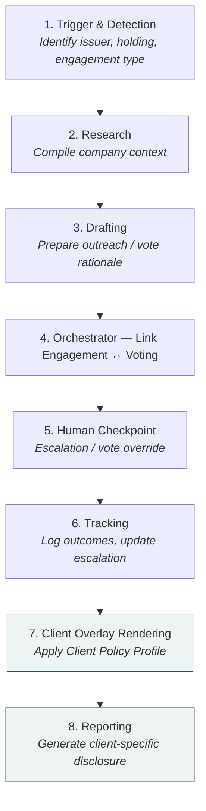

# Stewardship Automation — Data Model, Process Graph, and Process Activities

One data model, one process graph, and eight stages of activity. House truth is written once per issuer or resolution; the client overlay only enters at stages 7–8.

**Status: target model, not yet implemented.** This is the operating model the
stewardship module is heading toward. The house-truth half (stages 1–6) largely
exists today as the v1 engagement/voting backend described in
[`ENGAGEMENT_VOTING_ARCHITECTURE.md`](ENGAGEMENT_VOTING_ARCHITECTURE.md), though
with a different shape in places. The client overlay (stages 7–8) does not exist
yet. [Part 4](#part-4--mapping-to-the-v1-code) maps each entity and stage onto
the current code and lists the gaps.

---

## Part 1 — The Data Model

A client-agnostic **house truth** layer, written once per issuer or resolution, with a thin **client overlay** that filters, weights, or overrides it — never duplicates it.

```mermaid
erDiagram
    ISSUER {
        string issuer_id PK
        string name
        string sector
        string region
        decimal clti_score
        decimal nature_score
    }
    ENGAGEMENT_RECORD {
        string engagement_id PK
        string issuer_id FK
        string trigger_type
        string topic
        string status
        array outreach_history
    }
    HOUSE_VOTING_DECISION {
        string resolution_id PK
        string issuer_id FK
        date meeting_date
        string resolution_text
        string house_recommendation
        string rationale
    }
    ESCALATION_LOG {
        string escalation_id PK
        string resolution_id FK
        int stage
        array stage_history
        string checkpoint_decision
    }
    CLIENT {
        string client_id PK
        string name
        string mandate_type
    }
    CLIENT_POLICY_PROFILE {
        string client_id PK_FK
        json priority_weights
        json voting_policy_deltas
        string voting_delegation_mode
        string reporting_template_ref
    }
    CLIENT_ENGAGEMENT_VIEW {
        string client_id PK
        string engagement_id PK
        decimal relevance_score
    }
    CLIENT_VOTE_INSTRUCTION {
        string client_id PK
        string resolution_id PK
        string instruction
        string rationale
    }
    PORTFOLIO {
        string portfolio_id PK
        string client_id FK
        string vehicle_type
    }
    HOLDING {
        string portfolio_id PK
        string issuer_id PK
        decimal weight
        string sector
    }
    REPORT {
        string report_id PK
        string client_id FK
        string period
        array delivery_log
    }

    ISSUER ||--o{ ENGAGEMENT_RECORD : "1:N"
    HOUSE_VOTING_DECISION ||--o{ ESCALATION_LOG : "1:N"
    CLIENT ||--|| CLIENT_POLICY_PROFILE : "1:1"
    ENGAGEMENT_RECORD ||--o{ CLIENT_ENGAGEMENT_VIEW : "1:N"
    CLIENT_POLICY_PROFILE ||--o{ CLIENT_ENGAGEMENT_VIEW : "1:N"
    HOUSE_VOTING_DECISION ||--o{ CLIENT_VOTE_INSTRUCTION : "1:0..N"
    CLIENT_POLICY_PROFILE ||--o{ CLIENT_VOTE_INSTRUCTION : "governs"
    CLIENT ||--o{ PORTFOLIO : "1:N"
    PORTFOLIO ||--o{ HOLDING : "1:N"
    ISSUER ||--o{ HOLDING : "1:N"
    CLIENT_POLICY_PROFILE ||--o{ REPORT : "renders"
```

*Two relationships are implicit rather than drawn: `House Voting Decision` also carries `issuer_id` as a lookup field (no separate Issuer edge), and `Escalation Log` can in practice be opened from either an Engagement Record or a House Voting Decision — the diagram shows the voting path; the tables below cover both.*

### House truth — client-agnostic, written once

#### Issuer
The central key every other entity ultimately hangs off.

| Field | Type | Notes |
|---|---|---|
| issuer_id | PK, string | Central identifier used for matching across all systems. |
| name, sector, region | string | Static reference attributes. |
| clti_score, nature_score | decimal, versioned | Latest transition and nature scores from the extraction/scoring layer. |

#### Engagement Record

| Field | Type | Notes |
|---|---|---|
| engagement_id | PK, string | |
| issuer_id | FK → Issuer | 1 : N — one issuer can have many engagement records over time. |
| trigger_type | enum | event \| calendar |
| topic, theme | string | What the engagement is about. |
| status, outreach_history | string, array | Current state and log of communications. |

#### House Voting Decision

| Field | Type | Notes |
|---|---|---|
| resolution_id | PK, string | One row per resolution at a given meeting. |
| issuer_id | FK → Issuer | Implicit link — shown for lookup, not drawn as a separate diagram edge. |
| meeting_date, resolution_text | date, string | |
| house_recommendation, rationale | string | The house baseline decision, before any client override. |

#### Escalation Log

| Field | Type | Notes |
|---|---|---|
| escalation_id | PK, string | |
| resolution_id | FK → House Voting Decision | 1 : N — an escalation is opened off a voting decision that failed to resolve an issue. |
| stage, stage_history | int, array | Position on the 7-step escalation ladder. |
| checkpoint_decision | string | Human override or confirmation, where applicable. |

### Client overlay — thin, per client

#### Client / Asset Owner

| Field | Type | Notes |
|---|---|---|
| client_id | PK, string | |
| name, mandate_type | string | SMA, CCF, or ETF mandate. |

#### Client Policy Profile
The configuration object that turns the house engine into a client-specific one.

| Field | Type | Notes |
|---|---|---|
| client_id | PK/FK → Client | 1 : 1 — each client has exactly one active profile. |
| priority_weights | JSON | Region × sector × theme weighting. |
| voting_policy_deltas | JSON | Client guidelines vs. house baseline, as explicit overrides. |
| voting_delegation_mode | enum | house_voted \| ptv_pass_through |
| reporting_template_ref | FK → report template | |

#### Client Engagement View

| Field | Type | Notes |
|---|---|---|
| client_id + engagement_id | composite PK | A lens on the house Engagement Record, not a copy. |
| relevance_score | decimal | Derived at read time from the client's priority weights. |

#### Client Vote Instruction

| Field | Type | Notes |
|---|---|---|
| client_id + resolution_id | composite PK | 1 : 0..N off House Voting Decision — most clients generate zero rows here. |
| instruction, rationale | string | Only populated where a client deviates or self-directs via PTV. |

### Shared / reference

#### Portfolio / Mandate

| Field | Type | Notes |
|---|---|---|
| portfolio_id | PK, string | |
| client_id | FK → Client | 1 : N — a client can hold several portfolios/mandates. |
| vehicle_type | enum | SMA \| CCF \| ETF |

#### Holding

| Field | Type | Notes |
|---|---|---|
| portfolio_id + issuer_id | composite PK | Flat structure — no look-through, one row per holding. |
| weight, sector | decimal, string | Carried directly on the row, per the risk-exposure agent's data-layer assumption. |

#### Disclosure / Report
Never stored content — a query over house truth filtered through the client's profile at generation time.

| Field | Type | Notes |
|---|---|---|
| report_id | PK, string | |
| client_id | FK → Client | Determines which template and which client views/instructions to render. |
| period, delivery_log | date range, array | Audit trail of what was sent and when. |

---

## Part 2 — The Process Graph

Stages 1–6 operate entirely on house truth. Stages 7–8 (client overlay) are where the Client Policy Profile enters.



---

## Part 3 — Process Activities

Each stage's activities, and its explicit read/write contract with the data model defined in Part 1.

### 1. Trigger & Detection
**Activities**
- Detect calendar-based triggers (proxy season) and event-based triggers (controversy news, AGM notice)
- Identify the affected issuer, holding, and required engagement type

**Reads:** Holding, Issuer
**Writes:** Engagement Record (create)
**Human checkpoint:** —

### 2. Research
**Activities**
- Compile company-specific context: history, controversies, prior engagement
- Pull the latest CLTI/TNFD scores and thematic relevance for the issuer

**Reads:** Issuer (scores/history), Engagement Record
**Writes:** Engagement Record (context populated)
**Human checkpoint:** —

### 3. Drafting
**Activities**
- Prepare outreach content for the engagement
- Draft voting rationale where a linked resolution exists

**Reads:** Engagement Record, House Voting Decision
**Writes:** House Voting Decision (draft rationale)
**Human checkpoint:** —

### 4. Orchestrator — Link Engagement ↔ Voting
**Activities**
- Connect the engagement record to its linked voting decision via shared state
- Generate a Client Vote Instruction for any client whose profile creates a deviation from house baseline

**Reads:** Engagement Record, House Voting Decision
**Writes:** House Voting Decision (linked engagement_id), Client Vote Instruction (0..N)
**Human checkpoint:** —

### 5. Human Checkpoint
**Activities**
- Review flagged escalations and decide the next step on the escalation ladder
- Approve or override the house voting decision where required

**Reads:** Escalation Log, House Voting Decision
**Writes:** Escalation Log (checkpoint_decision), House Voting Decision (final override)
**Human checkpoint:** Escalation and vote-override decisions

### 6. Tracking
**Activities**
- Log engagement outcomes and update status
- Update escalation stage history

**Reads:** Engagement Record, Escalation Log
**Writes:** Engagement Record (status, outreach_history), Escalation Log (stage_history)
**Human checkpoint:** —

### 7. Client Overlay Rendering *(client overlay)*
**Activities**
- Apply each Client Policy Profile's priority weights to filter/weight the house Engagement Record into a Client Engagement View
- Apply voting policy deltas to determine the Client Vote Instruction where not already generated at stage 4

**Reads:** Engagement Record, House Voting Decision, Client Policy Profile
**Writes:** Client Engagement View (relevance_score), Client Vote Instruction
**Human checkpoint:** —

### 8. Reporting *(client overlay)*
**Activities**
- Aggregate house truth and client overlay records into the client's disclosure schema
- Generate the client-specific disclosure document or pivot-table view
- Log delivery

**Reads:** Engagement Record, House Voting Decision, Escalation Log, Client Engagement View, Client Vote Instruction, Portfolio, Holding
**Writes:** Disclosure/Report (create), delivery_log
**Human checkpoint:** Compliance/legal review before external send

---

**The pattern to notice:** stages 1–6 never reference a Client Policy Profile, Client Engagement View, or Client Vote Instruction — those entities don't exist until stage 7. Onboarding a new institutional client only ever means adding rows at stage 7–8, never touching stages 1–6.

One apparent exception: stage 4 lists Client Vote Instruction among its writes. Read that as an optimisation. Stage 4 may create instructions early when the house decision is being linked anyway, but stage 7 remains the stage that owns them, and stage 4 needs no client-specific logic of its own.

---

## Part 4 — Mapping to the v1 code

Where each entity and stage lives in the current backend (see
[`ENGAGEMENT_VOTING_ARCHITECTURE.md`](ENGAGEMENT_VOTING_ARCHITECTURE.md) §10 for
the full file index). "Gap" means nothing in the code corresponds yet.

### Entities

| Target entity | v1 equivalent | Differences |
|---|---|---|
| Issuer | `company_id` string, used as the join key throughout (`SecurityResolution.company_id`, `EngagementRecord.company_id`, `Proposal.company_id`) | No Issuer entity of its own. `name`/`sector` are repeated on `EngagementRecord`, and there is no `region`. **Gap:** no `clti_score` / `nature_score` field anywhere. |
| Engagement Record | `EngagementIssue` inside `EngagementRecord` (`schemas/engagement.py`) | v1 keeps **one record per company** and nests the issues inside it. The target's per-engagement record corresponds to an `EngagementIssue` (`issue_id` ≈ `engagement_id`, `theme` ≈ `topic`, `status`, `correspondence` ≈ `outreach_history`). `TriggerSource` has no event/calendar split. |
| House Voting Decision | `VoteRecord` (`schemas/voting.py`): `Proposal` + `PolicyRecommendation` + `HumanVoteDecision` | `proposal_id` ≈ `resolution_id`. `PolicyRecommendation.vote`/`rationale` ≈ `house_recommendation`/`rationale`, and `HumanVoteDecision` is the stage-5 final override. **Gap:** no `engagement_id` link; the link today is an implicit `company_id` + theme match in `check_engagement_alignment`. |
| Escalation Log | `EngagementIssue.escalation_stage` + `escalation_history: list[EscalationTransition]` | v1 attaches escalation to the **engagement issue**, whereas the target model hangs it off the voting decision. The target allows both parents, and v1 covers only the engagement one. `EscalationTransition.decided_by`/`reason` ≈ `checkpoint_decision`. |
| Client | — | **Gap.** The closest thing is a free-text `"client:..."` tag on `Portfolio.tags`. |
| Client Policy Profile | — | **Gap.** Voting policy is house-only (`DEFAULT_POLICY_RULES` in `voting/policy_agent.py`), and `apply_policy` already accepts an arbitrary `rules` list, which is where `voting_policy_deltas` would plug in. |
| Client Engagement View | — | **Gap.** |
| Client Vote Instruction | — | **Gap.** There is one vote per proposal; nothing is stored per client. |
| Portfolio | `Portfolio` (`schemas/portfolio.py`) | **Gap:** no `client_id` and no `vehicle_type` (SMA/CCF/ETF). |
| Holding | `Holding` (`schemas/portfolio.py`) | Keyed by `security_id` + `as_of_date` (immutable snapshots), not `issuer_id`. The issuer is reached through `SecurityResolution`. `weight_pct` ≈ `weight`, and there is no `sector` on the row. |
| Disclosure / Report | `compile_report` (`engagement/reporting_agent.py`) | Already computed on demand rather than stored, as the target requires. **Gap:** it is house-wide with no client filter, and there is no `delivery_log`. |

### Stages

| Stage | v1 implementation | Gap |
|---|---|---|
| 1. Trigger & Detection | `engagement/triggers.py`: `run_trigger_screen`, `scan_for_stalled_issues` | The calendar trigger (AGM / proxy season) is not built (architecture doc §6.3). The screen also doesn't read Holding, since it takes an explicit company list. |
| 2. Research | `engagement/research_agent.py` → `ResearchDossier` | No CLTI/TNFD score lookup. |
| 3. Drafting | `engagement/drafting_agent.py`; vote rationale from `voting/policy_agent.py` | — |
| 4. Orchestrator | `engagement/orchestrator.py::decide_next_action`, `voting/policy_agent.py::check_engagement_alignment` | No persisted engagement↔vote link, and no Client Vote Instruction generation. |
| 5. Human Checkpoint | `EngagementStore.set_escalation_stage` (requires `decided_by`), voting review queue + `co_signed_by` | — |
| 6. Tracking | `engagement/tracking_agent.py` | — |
| 7. Client Overlay Rendering | — | Not built. |
| 8. Reporting | `engagement/reporting_agent.py::compile_report` | No per-client rendering, no delivery log, and no compliance-review gate before sending. |

### Suggested build order

1. Add `Client` and `ClientPolicyProfile` as new models, and put `client_id` / `vehicle_type` on `Portfolio`. This is additive and changes nothing in stages 1–6.
2. Stage 7: compute `relevance_score` at read time from `priority_weights`. For vote instructions, run `apply_policy` once with house rules and once with the client's delta rules, and store a `ClientVoteInstruction` only where the two results differ (so most clients produce zero rows, as the model intends).
3. Stage 8: add a `client_id` filter to `compile_report` and log each delivery.
4. Store an explicit `engagement_id` on `VoteRecord` so the stage-4 link no longer depends on a theme match.
5. Add Issuer scores (`clti_score`, `nature_score`) once the scoring layer that produces them exists.
